# PhoenixAdult — Design Document

**Status:** living document · **Audience:** maintainers & contributors
**Scope:** the Python/FastAPI Plex metadata provider in this repository, built on Plex's Metadata Provider API.

This document is *model-based*: each section leads with a diagram (UML-style, rendered with Mermaid) and the prose only explains what the model cannot. Diagrams are grounded in the current source — file references are given so a model can be checked against code.

---

## 1. Purpose & System Overview

PhoenixAdult is an HTTP service that implements the **Plex Metadata Provider** contract for adult video libraries. Plex sends it a filename to *match*, then asks it for *metadata* and *images* for the chosen result. The service scrapes ~hundreds of studio/network sites, normalizes the data into Plex's schema, resolves actor headshots from external sources, and proxies all images back through itself.

| Dimension | Value (current) |
|---|---|
| Providers | 1 (`phoenixadult`) |
| Scraper config variants (`type`) | one per client |
| `Client` subclasses | one per scraper (discovered into `CLIENT_REGISTRY`) |
| Site/network definition groups | one per scraper type (spanning ~1,200 individual sites) |
| Actor-photo sources | 8 (IAFD, AdultDVDEmpire, Indexxx, Babepedia, …) |
| HTTP-bypass backends | 4 (Impersonate, FlareSolverr, Playwright, ReqBin) |
| Runtime | Python 3.13, FastAPI, uvicorn, httpx2 (async), parsel (XPath / lxml), Pillow |

---

## 2. System Context (C4 — Level 1)

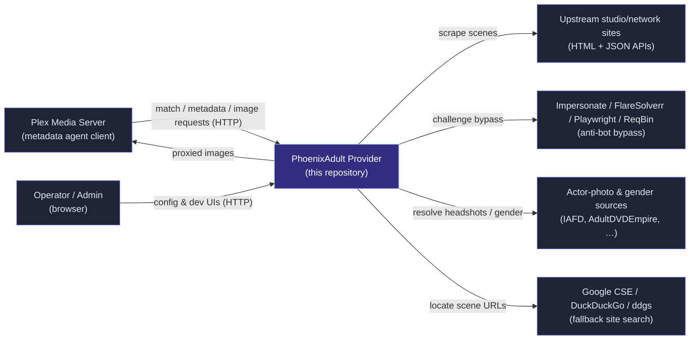

**Trust note:** Plex and the upstream sites are *not* trusted inputs. Plex-supplied ratingKeys/filenames and scraped content both cross a trust boundary (see §10).

---

## 3. Use Cases

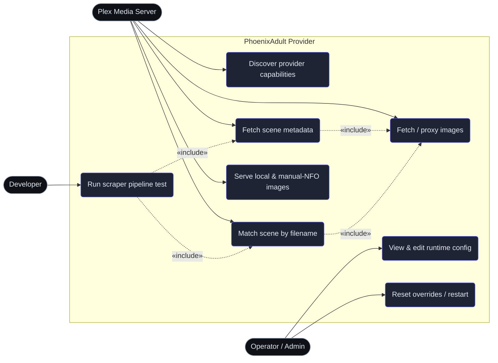

| Use case | Entry point | Auth |
|---|---|---|
| Discover capabilities | `GET /<provider mount>/` | none (public contract) |
| Match scene | `POST /<mount>/library/metadata/matches` | none |
| Fetch metadata | `GET /<mount>/library/metadata/{rating_key}` | none |
| Fetch/proxy image | `GET\|HEAD /images/proxy`, `/images/proxy-classified` | none (SSRF-guarded) |
| Local/manual images | `GET /images/local/{filename}`, `/images/manual-nfo/*` | none (path-guarded) |
| Sign in / first-run setup | `GET\|POST /login`, `/setup` | public (rate limited; `/setup` 404s once a user exists) |
| Runtime config | `GET\|POST /config/...` | **session or API key** |
| User accounts | `GET\|POST /users/api/...` | **session or API key, admin only** |
| Account self-service | `GET /account` + `POST /account/api/...` | **session or API key** |
| Cache / logo / queue review UIs | `GET /people`, `/metadata`, `/logos`, `/queue` | **session or API key** (read-only for non-admins — write controls hidden and their endpoints 403) |
| Stored-search browser | `GET\|POST /searches/...` | **session or API key, admin only** — page, APIs, and nav link all hidden from non-admins |
| Cache editors | `GET /metadata/edit` (per-field/per-image/image-set locks: locked pieces survive re-scrapes; editing a field auto-locks it; the header links to the source scene or listing page decoded from the cur_id — `SiteInfo.direct_url_template` rebuilds it for slug-only sites — the Edit button opens the editor in a new tab, which Save and Cancel close, refreshing the list behind it in place; the tab is opened *without* `noopener`, because a tab with no opener cannot close itself, and both pages are same-origin. An editor opened directly — no opener — falls back to navigating to the list at the offset carried in its `back` parameter (filters and sort come back from `localStorage`, so only the page number needs the round trip); a second header link opens the Data18 page for whatever numeric id the form currently holds, `scenes/` or `movies/` by the type select, updating as you type and hidden while the field is blank; and JSON/API payloads render in a lazy Source JSON panel via `GET /metadata/source-json`), `/people/edit` | **session or API key**; `POST …/save` and every purge/restore/gender/fetch/rescan/flush endpoint is **admin only** |
| Snapshot re-scrape | `POST /metadata/refresh`, `/metadata/refresh-bulk` | **session or API key, admin only** (re-scraping rewrites snapshots); `GET /metadata/snapshot` stays readable |
| Cast autocomplete | `GET /metadata/actors?q=` | **session or API key** |
| Plex connections | `GET\|POST /plex/connections/...` | **session or API key; each connection is scoped to its owner** |
| Dev pipeline test | `GET\|POST /dev/...` (`DEV_UI_ENABLE` only) | **session or API key** |
| Image serving | `GET /images/*`, `GET /cache/*` | guarded by default (`IMAGE_GUARD_ENABLE`); served only signed URLs (`sig=` HMAC keyed by the server secret, no expiry — `phoenixadult/utils/auth/url_signing.py`), Plex (`PlexMediaServer` UA), image fetchers (`Accept: image/*` non-navigation), loopback, a session/API key, or same-origin admin-UI subresources — direct browsing gets 403 (`phoenixadult/utils/auth/image_guard.py`) |
| Provider endpoints | `GET\|POST /<mount>/...` | **`User-Agent` must contain `PlexMediaServer`** — browsers and everything else get 404, so the mount is invisible to them (`phoenixadult/routes/provider_guard.py`). With `TOKEN_BASED_AUTH` the mount answers only via `/api/hook/{api-key}/<mount>` (`phoenixadult/utils/auth/hook_middleware.py` validates the key, rate-limits failures per IP, and rewrites the path before routing; the token segment is always masked in logs) — strictly, with no loopback or session bypass. With `CLIENT_TOKEN_REQUIRED`, match/metadata requests also need an `X-Plex-Client-Identifier` registered under a connection (the capability document stays open so the provider can always be added). `API_REQUESTS_PER_DAY` caps each client and each key per day (429 + `Retry-After`). Every request, refused ones included, is dumped at `verbose` with credential headers masked (`utils/logging/request_trace.py`) |

The admin pages extend a single shell, `phoenixadult/routes/html/base.html` (doctype/head/favicon/title skeleton + `title`/`head`/`page`/`chrome`/`content`/`scripts` blocks); each page keeps only its own `<style>`, markup and script. Shared front-end helpers (`esc`/`qs`/`hdrs` and the SFW-toggle mechanics) live in `common.html`. Navigation between routes is a progressive enhancement: `theme.html` opts into cross-document **View Transitions** (`@view-transition { navigation: auto }`, disabled under `prefers-reduced-motion`) with the fixed nav held persistent via `view-transition-name`, and `nav.html` carries a **Speculation Rules** block that prerenders a nav destination on hover so the click activates an already-rendered page — both no-ops on browsers that lack them.

Every admin page shares one fixed top nav — Metadata, People, Logos, Queue, Searches (admins only), Dev, Config — rendered from `phoenixadult/routes/html/nav.html`, a Jinja2 partial pulled into each page template with `` (the shared autoescaping environment and `render_page()` live in `phoenixadult/routes/__init__.py`), including the `/metadata/edit` and `/people/edit` sub-pages (which highlight their parent). The Dev link appears only when `DEV_UI_ENABLE` is on; the signed-in username links to `/account` and sits beside a Log Out button. The session cookie carries auth across navigation, so no token is threaded through links.

The nav injection also carries the theme kit. Every color on every page is a CSS custom property named for the **element it styles** (`--card-bg`, `--button-primary-bg`, `--female`, …) and defined in per-theme stylesheets under `phoenixadult/routes/html/themes/` — `midnight`/`forest` (dark) and `sky`/`meadow` (light), served publicly at `/themes/<name>.css` and validated against `THEME_NAMES` (`phoenixadult/routes/__init__.py`). Each theme file lists the shared element variables by category, then one `[data-page="…"]` block per page, so a single element on a single page can be recolored without touching anything else (each `<body>` carries its `data-page`). Pages follow the system light/dark mode by default; the sun/moon/Auto toggle on the right of the nav overrides the mode (`localStorage` `pa-theme`), and the Config UI's **Theme** tab picks which theme each mode loads — **stored on the signed-in user's account** (`users.theme_dark`/`theme_light`, saved via `POST /config/api/theme`, injected as `window.paUserTheme` at render) so one user's choice never touches another's; `localStorage` (`pa-theme-dark`/`pa-theme-light`) remains the instant-apply and signed-out fallback. The tab also renders a per-page element preview of the selected light and dark themes side by side. `theme.html` is only the boot loader that swaps the `<link>`. Every page is built for phones as well as desktops: a real `<head>` with `width=device-width`, inputs at 16px (smaller makes iOS zoom on focus), and a `@media (max-width: 720px)` block that collapses each wide table into stacked label/value rows via `data-label` — enforced by `tests/routes/test_mobile_layout.py`. Templates never use raw hex colors, and every referenced variable must exist in every theme — both enforced by `tests/routes/test_nav.py`.

Color is per theme; everything else is shared. `base.html` declares the non-color tokens once — the two font roles (`--font-ui`, `--font-mono`), a seven-step type scale (`--text-2xs` … `--text-2xl`), spacing (`--space-1` … `--space-6`), radii and one elevation shadow — plus the `box-sizing` reset, the `body` font/background, the shared `h1`/`.sub`, and the `:focus-visible` ring. Pages inherit all of it and set only their own `padding`; the theme-variable test skips tokens it finds declared in `base.html`. The two typefaces are vendored as OFL latin subsets under `phoenixadult/routes/html/fonts/` and served at `/fonts/<name>.woff2`, allowlisted against `FONT_NAMES` the same way themes are — `@font-face` lives in `theme.html` so the standalone `login`/`setup`/`account` templates get them too, and `package-data` must keep shipping `**/*.woff2` or the port serves a missing font. Mono is semantic: it marks identifiers (hashes, `cur_id`s, keys, paths), never decoration.

`/logos` browses the clearLogo cache and `/logos/add` fills the gaps: it lists every sub-site of a studio that still lacks a logo, one row apiece, each taking a pasted URL or a dropped file. Networks that serve their logos from a predictable path are handled in bulk by the **logo URL template** — one address carrying placeholders (`{domain}` and the `{subsiteclean}` / `{subsite-name}` / `{subsite_name}` / `{subsite}` name forms, their `{studio…}` equivalents, and `{ext}` to try `.svg`/`.png`/`.webp`/`.jpg` in turn), expanded server-side by `phoenixadult/utils/images/logo_template.py` so the slug rules stay in Python. **Try All Subsites** expands the template into every row and fetches them in one pass, deliberately skipping the whole-studio row; an unknown placeholder is refused by name rather than producing a page of broken URLs. A template that fetched something is remembered per studio and offered back the next time that studio is picked. Fetches reuse the ordinary image chain (referers, then the impersonate bypass), and reject hosts that are loopback, link-local or a private IP literal so one template cannot be turned into a LAN sweep. Every logo is trimmed of dead space and SVGs are rasterised on the way in.

> First run: with no accounts in the database every admin page redirects to `/setup`, which creates the first (admin) account and signs it in. After that `/setup` 404s and `/login` is the only way in — there is no loopback bypass. If every admin password is lost, `python scripts/reset_password.py <username> --create-admin` restores access from a shell on the server.

---

## 4. Container / Component Model (C4 — Level 2)

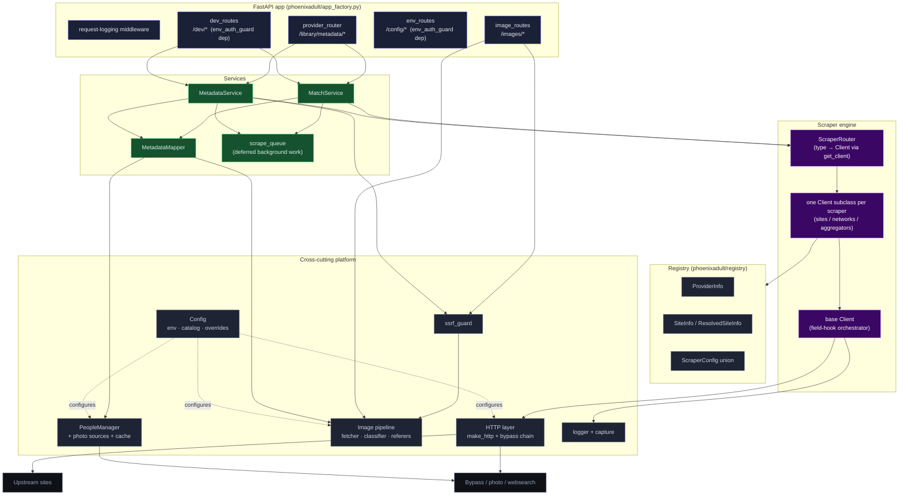

**Key relationships**

- **Routes are thin.** `provider_router` (`phoenixadult/routes/provider_router.py`) delegates immediately to `MatchService` / `MetadataService`.
- **`ScraperRouter`** (`phoenixadult/services/scraper_router.py`) is a dispatcher: it resolves a scraper `type` to its single `Client` instance via `get_client` (`phoenixadult/clients/__init__.py`, `CLIENT_REGISTRY`). It owns `search`, `fetch_scene_detail`, and `decode`.
- **`MetadataMapper`** (`phoenixadult/mappers/metadata_mapper.py`) translates the scraper's `SceneDetail` into Plex's schema and rewrites every image URL through the `/images/proxy` endpoint.
- **Registry** is static data: providers, sites, and per-site `ScraperConfig` that selects and parameterizes a client.
- **`scrape_queue`** (`phoenixadult/services/scrape_queue.py`) runs background jobs on two lanes (dedup by key, 10,000-job cap): unpaced sites take five workers, sites behind a `ScenePacer` take exactly one, so a pacer's gate can never occupy every slot. When pacing or the serve budget defers a search/update (§7.6), the services enqueue it here to finish off the request path.
- **`FAST_GATE`** (`phoenixadult/utils/http/rate_limit_helper.py`) caps unpaced scene scrapes at five concurrent slots shared across all unpaced sites, inline and background alike (re-entrant per task, so a client that delegates to another client reuses its slot). An inline refresh waits up to the 10s sync budget for a slot, then raises `PacingDeferredError` and lands in the visible queue — so every unpaced backlog shows on `/queue`, which also renders the gate's busy/waiting counts. Searches on unpaced sites stay inline and ungated.

---

## 5. Domain & Data Model

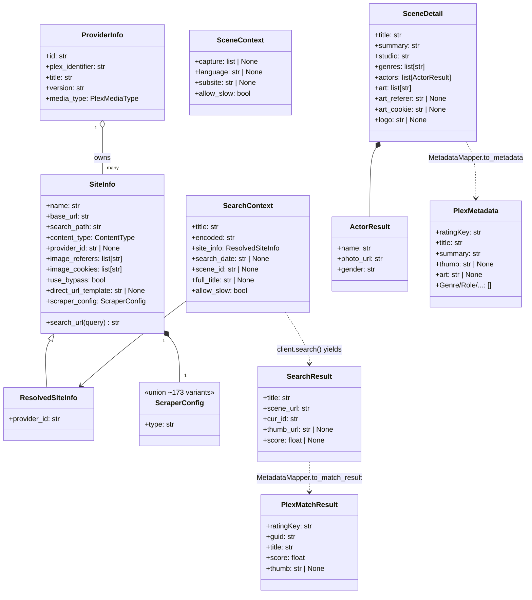

### 5.1 Identifier Lifecycle (the Spine of the System)

The same scene is represented differently at each stage; the encoding is reversible so a Plex `ratingKey` round-trips back to a fetchable scene URL.

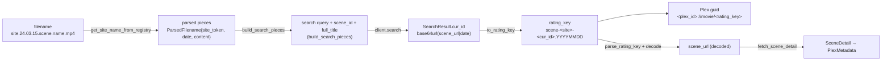

- Encode/decode: `Client.encode` / `Client.decode` = base64url, backed by `b64url_encode` / `b64url_decode` (`phoenixadult/utils/helpers/ids.py`); `cur_id` is assembled by `pack_cur_id`.
- `to_rating_key` / `parse_rating_key`: `phoenixadult/mappers/metadata_mapper.py` (regex `^scene-([a-z0-9]+)-([A-Za-z0-9_-]+)(?:\.(\d{8}))?$`).
- **Security-relevant:** the decoded `scene_url` is attacker-influenceable and is validated by `ensure_fetchable_url` (`phoenixadult/utils/http/ssrf_guard.py`) before any fetch (§10).

### 5.2 Persistent State (phoenixadult.db)

Mutable state — queue replays, the search store, the fully normalized scene snapshot store (scalars on `scenes`; dimension + junction tables for genres, collections, countries, people; image metadata in `scene_images`, image bytes on disk), and the derived people-image/logo indexes plus the face-crop log — lives in one SQLite database opened by `phoenixadult/utils/db` (WAL, FK-enforced, `PRAGMA user_version` migrations). Schema, normalization rationale, scoped-people resolution, and backup guidance (`VACUUM INTO`) are documented in [database.md](database.md). Two small JSON sidecars sit beside the database rather than in it: `logo-wells.json` (each logo's preferred backdrop) and `logo-templates.json` (the per-studio logo URL template), both rebuildable and safe to delete.

`refresh_cached_snapshot` re-applies text rules to every snapshot it serves, which is how a rule change reaches cached scenes without a re-scrape. One rule is site-scoped: a `scoregroup` snapshot whose summary opens with a repeat of its own title sheds it, keyed on `scraper_type` in the same way `_EPISODE_TAGGED` already is, because the Score Group template used to fold the description heading into the summary. It compares case-insensitively and also tries the title up to a ` - `, so a series entry named by its cast still matches.

Redundant snapshots are surfaced by two passes in `phoenixadult/utils/cache/duplicates.py`. The *stale* pass keys on the rating key, so a subsite-qualified `cur_id` supersedes the bare one. The *content* pass groups snapshots that share a normalized title, release date, studio and tagline **and** the site's own scene id, parsed from `source_url` by `scene_url_id` (an `id=` query parameter, else a trailing all-digit path segment; empty when the URL carries neither). One scene published under two slugs therefore still groups, while two entries of a recurring series that reuses its title — Score Group's `Funbag Fuckers` — no longer do. Purging drops every rating-key-superseded entry plus all but the newest member of each content group.

A third pass, `integrity.missing_image_entries()`, lists the scenes whose `thumb` or `art` cannot render — the state that draws a broken thumbnail rather than the "No image" placeholder. Two things qualify: a `/cache/…` path whose file is gone, and a URL the scrape never localized at all (an `/images/proxy?url=…` left behind by a failed download), which is the commoner of the two. An empty field is not broken; it is what produces the placeholder. It backs the **Show Missing Images** filter on `/metadata`, which composes with the duplicate filters by intersection, so **Refresh Filtered** re-scrapes exactly the affected snapshots. One stat per snapshot path, with the cache root resolved once for the whole scan rather than per URL, and memoized on the same change token as the duplicate scans.

---

## 6. Scraper Client Hierarchy (Template Method / Field-Hook Pattern)

The base `Client` (`phoenixadult/clients/base.py`) defines two *orchestrators* — `search()` and `fetch_scene_detail()` — that call a fixed sequence of overridable *hooks*. A concrete client implements only the hooks relevant to its site; the orchestration (dedup, parallel field fetch, capture logging, bypass fallback) lives once in the base. **Every scraper is hand-written** — there is intentionally *no* shared, config-driven client (no `JsonClient`, no per-network base class). Shared *helpers* are fine: `GraphQLClient` (`phoenixadult/clients/_graphql.py`), `html_helpers`, and the image adapters.

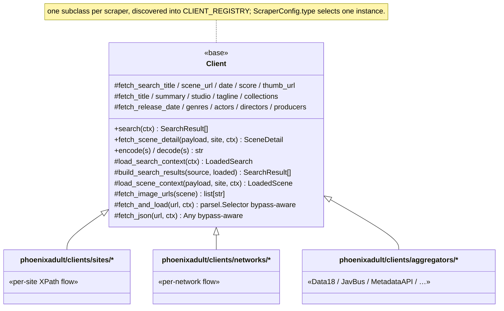

The search default = `load_search_context` + per-source `build_search_results` (which calls `fetch_search_scene_url` / `fetch_search_title` / `fetch_search_date` / `fetch_search_score` / `fetch_search_thumb_url`, dedups on `scene_url`, and packs the `cur_id`). The detail default = `load_scene_context` + per-field hooks (`fetch_title` / `summary` / `studio` / `tagline` / `release_date` / `genres` / `actors` / `directors` / `producers` / `collections` / `image_urls`). `fetch_scene_detail()` fans the field hooks out with `asyncio.gather` (one network/parse step per field), then assembles a `SceneDetail`. Data18 enrichment picks its scene by scoring every search hit across every result page and keeping the best — highest accuracy, then smallest release-date gap — then the billed cast — because a title a studio reuses returns many same-provider hits that all clear the accuracy threshold, and two of them can share a release date. The cast comes from the `Scene w/ …` / `Movie w/ …` line on the result row, compared on alphanumerics so `J.T.` and `Jt` are one name; rows without that line rank on date alone, so a caller that passes no cast is unaffected. A candidate that scores the maximum on all three short-circuits the scan, which keeps the common case at one page. Because the hooks run concurrently, a rule that needs one field to see another belongs in an `update()` override that runs after `super().update()` — that is where Score Group appends the cast to the titles it reuses across unrelated scenes (`_SERIES_TITLES`). Score Group also scores and dates itself against the grain of the shared helpers, because it refreshes release dates to keep old scenes looking new: a candidate that is not an outright scene-id hit is scored `0.7 x title + 0.3 x date` rather than by `build_search_result`'s date-only branch (`date_distance_score` is a Levenshtein of the date *strings*, so a twelve-year gap still scores 94 — nearly useless on its own), and the stored release date is the **earlier** of the filename date and the scraped one. `display_date` keeps the scene's own date either way (`Funbag Fuckers - Shyla Stylez and J.T.`, comma-separated with a final `and`, males dropped when `GENDER_SKIP_MALE_ENABLE` is on at scrape time). `fetch_and_load` / `fetch_json` try a direct httpx2 request first and fall back to the bypass chain when enabled (§8); passing `form=` to `fetch_and_load` switches it to a form-encoded POST (the Score Group `/search-es` endpoint), bypass included; every response a client receives is dumped by `trace_response` (`utils/logging/response_trace.py`) — to a file under `<LOG_DIR>/dumps/`, to the verbose log, and to the dev UI capture sink from one call, so the three cannot drift; a request that never returns a response says so at `warn` rather than being swallowed; HTML is parsed XPath-only via `parsel.Selector` (lxml-backed). Parsing is cheap (~3 ms for a 170 KB page) but xpath evaluation is not, and it runs **on the event loop** — an unanchored `//div//span[...]` walks every div and then every descendant span of each, which measured 8–33 ms per page against 0.2 ms for the `//span[...]` that selects the same nodes. Anchor a descendant scan on an id or class, or start it at the element you actually want; the cost lands on every request the process is serving, not just the scrape that paid for it. Images are classified by aspect ratio (`classify_image`): a portrait image with aspect ~1.4–1.6 is a `coverPoster`, a landscape image is a `background`. `_probe_artwork` drops any url whose dimensions cannot be read, and `_resolve_artwork` picks the poster and background from what *survived* that probe — never from the raw `detail.art` list, because falling back past the validation is how a url the site 404s reaches a snapshot and renders as a broken card. A scene whose every artwork url is dead gets no poster at all, and says so at `info`. clearLogos are managed separately from scenes: `phoenixadult/utils/images/logo_cache.py` stores `logos/<studio-slug>/logo.<name-slug>.<ext>` files (SVG rasterized via rsvg-convert/cairosvg/ImageMagick), reviewed at `/logos`, and pushed to Plex **collections** by `plex_reconcile.push_collection_logos` (the "Push Logos to Collections" action) — scenes never carry a logo.

---

## 7. Request Flows (Sequence Models)

### 7.1 Match — `POST /library/metadata/matches`

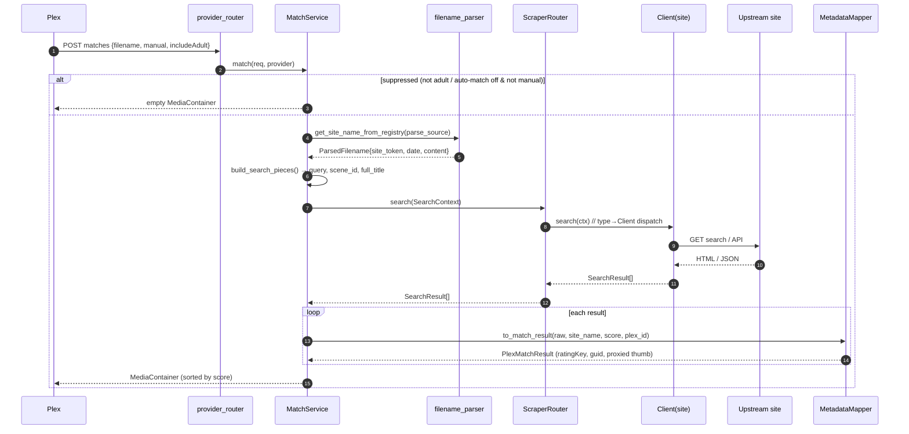

### 7.2 Metadata — `GET /library/metadata/{rating_key}`

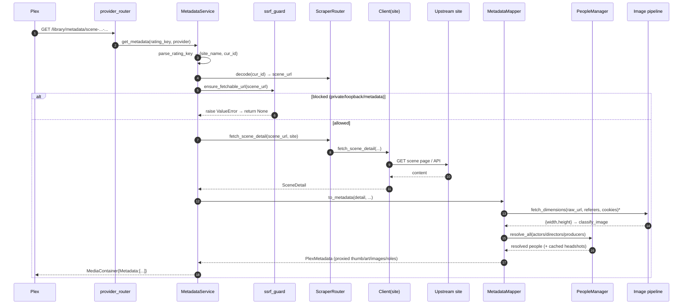

### 7.2.1 Provider Status Codes

Both features answer with the four codes Plex defines for metadata providers:

| Code | Match | Metadata |
|------|-------|----------|
| 200 | Results, or an empty MediaContainer (suppressed request, no registry site in the filename, no perfect auto match, site down while the internet is up) | Scraped or cached scene |
| 400 | No title/filename to parse | Malformed ratingKey: bad format, missing parts, unknown site, undecodable curID |
| 404 | Never | Valid ratingKey whose scene yields nothing while online |
| 500 | Pacing deferral, Plex-budget timeout, no network connectivity, unexpected exception | Same |

Never-succeeds requests raise `MalformedRequestError` and transient failures raise `ProviderUnavailableError` (`services/provider_errors.py`); the router maps them to 400/500. Connectivity is judged only when a scrape came up empty *and* a transport-level failure (DNS/connect) was recorded by the shared HTTP transport: a TCP probe of 1.1.1.1/8.8.8.8 (15s cached) then decides between "site down" (200/404) and "offline" (500). At `LOG_LEVEL=verbose` every match/metadata request is dumped with full headers and JSON body.

### 7.3 Scraper Fetch with Anti-Bot Bypass Fallback

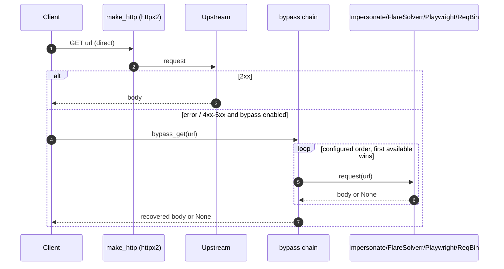

### 7.4 Image Proxy — `GET /images/proxy?url=…`

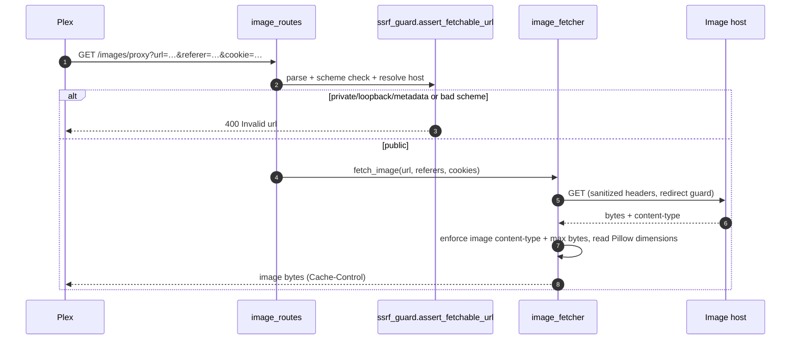

`/images/proxy-classified` is the same flow plus a `classify_image(width, height)` step; it returns 404 when the image classifies as `unknown` and stamps `X-Image-Type` on success.

### 7.5 Runtime Config Override

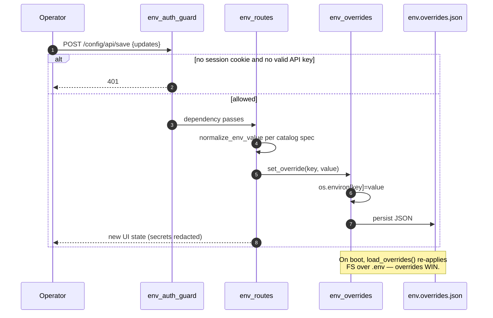

### 7.6 Serve Budget & Deferred Work

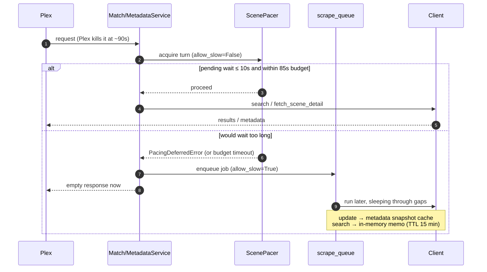

Plex aborts provider requests at ~90s, so both services cap serving at `PLEX_REQUEST_BUDGET` (85s): `MetadataService.get_metadata` wraps the coalesced scrape in `wait_for(shield(...))` — on timeout the scrape *continues* and lands in the snapshot cache — while `MatchService.match` cancels outright. Work deferred by pacing (`PacingDeferredError`, raised when a foreground request would wait >10s — by a `ScenePacer` on paced sites, or by the shared five-slot `FAST_GATE` on unpaced ones) is re-run through `scrape_queue` with `allow_slow=True`, which is allowed to sleep through the shared gap (or wait for a free slot). On paced sites a finished background search persists to the search store (`phoenixadult/utils/cache/search_store.py`, in `phoenixadult.db`, case/whitespace-normalized keys, lifetime `SEARCH_STORE_TTL_DAYS` — perpetual by default), so any later Plex scan matches without re-searching; the in-memory memo fronts the store. The queue and pacer state are visible at `/queue`, which holds a long poll (`GET /queue/api/state?wait=1&since=<revision>`) open against a revision counter bumped on every enqueue, start, finish, flush, pause and resume — so entries appear and clear the moment a worker moves, with no fixed polling interval.

### 7.7 Thread Pools — Keeping the UI Responsive Under Load

Every route is `async def`, so anything synchronous runs on the event loop unless handed to a thread. `asyncio.to_thread` hands work to the **one** default executor (`min(32, cpu+4)`), which every caller shares — so a scrape probing 60+ artwork URLs, each ending in a Pillow decode, could fill it and leave a `/people` or `/metadata` page's SQLite read queued behind image work.

`phoenixadult/utils/concurrency/pools.py` replaces that single pool with named, bounded ones, and `run_in(name, fn, …)` is a drop-in for `to_thread` against a chosen pool (it copies contextvars the same way, so request-id logging survives):

| Pool | Size | Carries |
|---|---|---|
| `store` | `max(8, min(32, cpu+4))` | SQLite reads/writes — cache pages, editors, search store, serve-path snapshot reads |
| `image` | `min(8, cpu/2)` | Pillow decode/dimension probing, face cropping |
| `fs` | 4 | People-cache file writes |
| `auth` | 4 | Session and API-key lookups, kept off `store` so a reporting query cannot delay sign-in |

Artwork probing is additionally capped at `_PROBE_CONCURRENCY` (8) per scene, so one scene's image set arrives as a stream rather than a burst. Pools are created on first use and shut down in the lifespan's `finally`.

The `store` bound doubles as a cap on SQLite connections: connections are per-thread (§5), so the pool size caps how many that pool holds rather than one per default-executor thread.

One gate is a limit of **one**: Score Group's `/search-es` accepts a single POST at a time and resets every other in-flight HTTP/2 stream with `INTERNAL_ERROR`, measured at 1/2, 1/3 and 1/5 concurrent against 6/6 serial. Its scene GETs are unaffected, so the chain looks healthy while search silently fails. The Impersonate backend also retries once on a dropped connection (stream reset, `Recv`/`Send failure`), which covers the residual; a failure that is not transient, like an unresolvable host, is not retried.

Fan-out limits are **process-wide, not per scene** (`utils/concurrency/gate.py`): a semaphore built inside the coroutine that uses it caps one scene, so N queue workers each open their own, and the real ceiling is N × the limit. Artwork probing, the two Data18 image probes and the snapshot image fetch all take their gate from `loop_gate(name, limit)`, keyed per event loop so tests stay isolated. This costs no throughput — the decode behind each probe runs on the `image` pool, so concurrency past that pool's width only lengthens its queue — and it is what keeps an interactive face-crop from queueing behind a bulk refresh, since `cache_photo` shares that pool. The startup banner prints the pool sizes, queue lanes, fan-out caps and the bypass chain with its FlareSolverr endpoint, because those are what you need when the UI goes slow or a backend quietly stops answering. A FlareSolverr transport failure names the endpoint it could not reach, so a wrong `FLARESOLVERR_URL` — unset, misspelt, or pointing at a stale address — is visible from the log line rather than only from the config.

A handler that needs several queries runs them **inside one pooled task** rather than gathering several — `/metadata` and its listing API each take a single `store` worker, not four. The rule this enforces: SQLite calls belong on a pool, not on the loop. Writes especially — `db.connect()` sets `busy_timeout=5000`, so a write issued from the event loop while a pool thread holds the write lock can stall every request for up to five seconds. Where a batch enqueues work that must stay on the loop (the scrape queue touches loop state), the per-item database work is hoisted into one pooled call ahead of the loop and the loop yields between items.

---

## 8. HTTP / Anti-Bot Bypass Model

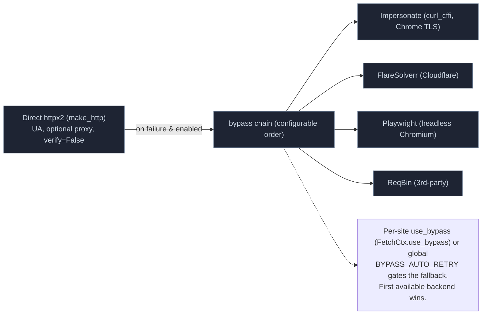

- `make_http` (`phoenixadult/utils/http/client.py`) builds a shared `httpx2.AsyncClient` (UA, optional proxy honouring `NO_PROXY`, TLS verification intentionally relaxed — `verify=False` — for janky CDNs; see §10 residuals).
- `phoenixadult/utils/http/bypass.py` (`bypass_get` / `bypass_post` / `http_bypass`) orders backends by `BYPASS_ORDER`, skips unavailable ones (each backend exposes `is_available()`), and returns the first 2xx that isn't itself a challenge page. The default order is **Impersonate → FlareSolverr → Playwright → ReqBin**; backends live in `impersonate.py`, `flaresolverr.py`, `playwright.py`, `reqbin.py`. The entry point used by clients is `bypass_get` (and `bypass_post` for GraphQL), surfaced on the base via `FetchCtx.use_bypass`.
  - **Impersonate** (`impersonate.py`) uses `curl_cffi` to mimic a real Chrome TLS/JA3 fingerprint. It is the only backend that defeats fingerprint-based Cloudflare blocks *and* forwards custom headers (e.g. `Referer`), so it leads the chain. Optional — install with `pip install -e ".[impersonate]"`; absent, it's skipped.
  - **FlareSolverr** solves Cloudflare interstitials via a sidecar container; it drops custom request headers.
  - **Playwright** drives headless Chromium (optional — `pip install -e ".[playwright]"`); forwards headers via the browser context.
  - **ReqBin** is a third-party fetch relay.
  - Challenge detection: a 2xx whose body still contains a challenge marker (AWS WAF, `just a moment`, `cf-chl-`, Turnstile) is treated as unsolved, so the chain continues to the next backend.
- **Ban-avoidance pacing** (`ScenePacer`, `phoenixadult/utils/http/rate_limit_helper.py`): ban-prone scrapers (`nubiles.py`, `naughtyamerica.py`) set `Client.pacer`, and the base orchestrators route every search and scene scrape through it. Searches and scenes share **one** gap track — after any turn the next waits `SCENE_GAP` (default 10s) plus a random 10–45s jitter — with a hard cap of 8 scenes per 10 minutes and jittered per-request spacing inside a scrape. A foreground (Plex-facing) request that would wait >10s raises `PacingDeferredError` and is finished via `scrape_queue` instead (§7.6).

---

## 9. People (Actor) Resolution Model

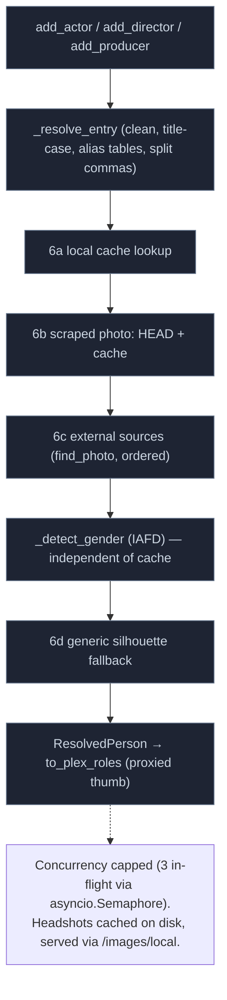

`PeopleManager.resolve_all` (`phoenixadult/utils/people/__init__.py`) drives the cascade per person: clean the name, title-case it (`title_case(..., type='name')`), drop skip-names, apply the per-studio then global alias tables (`ACTORS_REPLACE` / `ACTORS_REPLACE_STUDIOS` in `phoenixadult/utils/people/data.py`), then resolve a headshot in order. External photo sources live under `phoenixadult/utils/people/sources/` (8 site-specific XPath sources: `iafd`, `adult_dvd_empire`, `babepedia`, `babes_and_stars`, `boobpedia`, `indexxx`, `jav_database`, `local_storage`) and are fanned by `find_photo`. Retired sources (Freeones, JAVBus) wait in `phoenixadult/graveyard/`. Gender detection (`iafd_gender_check`, `phoenixadult/utils/people/gender.py`) is decoupled from the cache so `GENDER_DETECT_ENABLE` works regardless of `PEOPLE_CACHE_ENABLE`; `GENDER_SKIP_MALE_ENABLE` drops male actors. IAFD requires a bypass backend.

---

## 10. Security Model (Trust Boundaries)

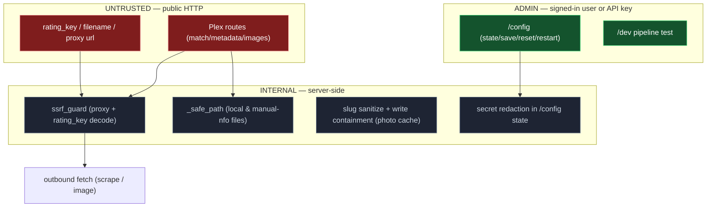

**Controls in place**

- **Admin auth** (`user_auth_guard`, `phoenixadult/utils/auth/user_auth.py`): wired as a router dependency on every admin router. Accepts a `pa_session` cookie (DB-backed, 30-day sliding expiry, HttpOnly + SameSite=Lax, `Secure` when the request arrives over https) **or** a per-user API key via `Authorization: Bearer` / `x-api-key`. Failure raises `LoginRequired`, which the app handler turns into a 302 to `/login?next=…` for browser navigations and a JSON 401 for everything else. There is no loopback bypass and no blank-token open mode.
- **Password policy** (`password_error`, `phoenixadult/utils/auth/passwords.py`): 8+ characters with an uppercase letter, a number, and a special character, enforced at every entry point (setup, account change, the Users tab, `scripts/reset_password.py`) with the same message mirrored client-side. An advisory zxcvbn strength meter (`password_strength`, served at `POST /api/password-strength`) scores as you type but never blocks.
- **Credentials at rest**: passwords hash with **argon2id** (`argon2-cffi`); API keys and session tokens are high-entropy random values stored as SHA-256 digests. The only reversible secret is the Plex token, which must be replayed to Plex — it is encrypted with Fernet using a key derived from `secret.key` (generated beside the database, never in the DB or environment) and is never returned by any API.
- **Brute force**: `/login` and `/setup` are throttled per IP+username — five free attempts, then exponential backoff to five minutes (`phoenixadult/utils/auth/rate_limit.py`), returning 429 with `Retry-After`.
- **CSRF**: the session cookie is `SameSite=Lax`; unsafe methods additionally require a same-origin `Sec-Fetch-Site` and a matching `Origin` host. API-key callers are exempt (a header credential cannot be replayed cross-site).
- **SSRF guard** (`phoenixadult/utils/http/ssrf_guard.py`): scheme allow-list + private/loopback/link-local/CGNAT/metadata (`169.254.169.254`) blocklist with hostname resolution; applied to the image proxy (`assert_fetchable_url`) and to the rating-key-decoded scene URL (`ensure_fetchable_url`).
- **Path safety**: `_safe_path` (`phoenixadult/routes/image_routes.py`) anchors containment on the resolved root; photo-cache slugging strips separators/`..` with a write-containment backstop.
- **Secret hygiene**: `/config/api/state` redacts secret values (exposes only whether set); the request-logging middleware deliberately does not log `/config` bodies (they can carry secrets being saved).

**Known residuals (documented, not yet fixed)** — see also `memory` notes:

- DNS-rebinding TOCTOU in the SSRF guard (resolve-then-fetch); robust fix = pin the validated IP for the outbound connection.
- Hostname-based internal SSRF on the *general* scrape path (only the metadata boundary + image proxy are guarded).
- Admin loopback-trust is bypassable behind a same-host reverse proxy (documented caveat); and the blank-token "auth off" mode opens the surfaces entirely.
- No inbound rate limiting (the outbound `ScenePacer` in §8 is ban-avoidance, not a security control); TLS verification intentionally relaxed (`verify=False`) for upstream CDNs.

> The `title_case` ReDoS (O(n²) post-process passes on long scraped titles) is **mitigated** by a `MAX_TITLE_LENGTH` input cap — see Appendix A.

---

## 11. Configuration Model

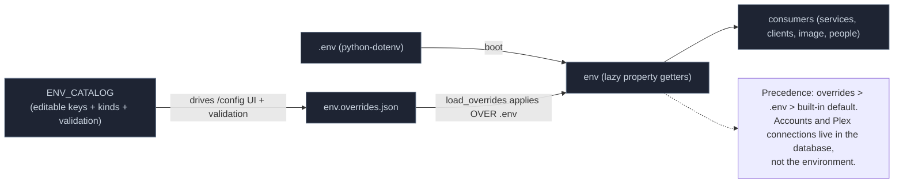

- Single source of env reads: `phoenixadult/config/env.py` — an `_Env` instance with lazy `@property` getters so a runtime override (or a test mutating `os.environ`) is reflected immediately.
- `phoenixadult/config/__init__.py` bootstraps the process: `load_dotenv()` then `load_overrides()`, and exposes the immutable startup `config` snapshot (`port`, `base_url`, `log_level`). Base URL env var is `PHOENIX_BASE_URL` (default `http://localhost:3000`).
- `phoenixadult/config/env_catalog.py` (`ENV_CATALOG`, `EnvVarSpec`, `normalize_env_value`) is the authority for what the config UI may edit and how values validate/normalize.
- `phoenixadult/config/env_overrides.py` (`set_override` / `clear_override` / `load_overrides`, file `env.overrides.json`) persists UI edits and re-applies them on boot — **this is the #1 debugging gotcha** (a stale override silently shadows `.env`).

---

## 12. Deployment

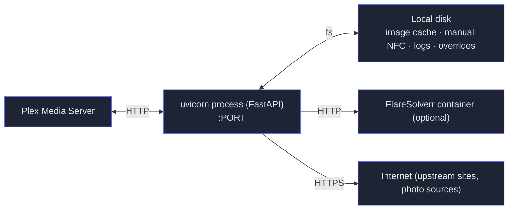

Single stateless-ish uvicorn process (state = on-disk caches + overrides). Run it with `python -m phoenixadult.main` (it calls `uvicorn.run`, auto-reloading outside production). Restart is supervised: `POST /config/api/restart` sends `SIGTERM` to its own PID and relies on a process supervisor to relaunch. FlareSolverr is an optional sidecar.

---

## 13. Patterns & Conventions (Map to Code)

| Pattern | Where | Why |
|---|---|---|
| Template Method / field hooks | `Client.search` / `fetch_scene_detail` + hooks | one orchestration, every site variation |
| Strategy / Registry dispatch | `get_client` → `CLIENT_REGISTRY`; `ScraperConfig` union | data selects behavior |
| Adapter | `MetadataMapper` (SceneDetail → Plex schema) | isolate Plex contract |
| Chain of Responsibility | bypass chain; people-source order | ordered fallback |
| Facade | Services over scraper/mapper/people | thin routes |
| Guard / Boundary validation | `ssrf_guard`, `_safe_path`, `env_auth_guard` | trust boundaries |
| Lazy config accessor | `phoenixadult/config/env.py` property getters | testability + runtime overrides |
| Fail-fast + deferred work | `ScenePacer` + `scrape_queue` + serve budgets | Plex's 90s timeout vs. slow, ban-prone sites |

**Conventions:** every scraper is hand-written (no shared `JsonClient`); shared helpers are explicit (`GraphQLClient`, `html_helpers`, image adapters). HTML parsing is **XPath-only via parsel** (lxml-backed). `RawCaptureEntry` capture entries thread raw upstream responses to the dev UI. Optional web-search augmentation provides a "find scene URL via search engine" path used by ~36 clients (e.g. `adultempire`, `colette`, `girlsoutwest`). Clients reach it through the single helper `web_search_urls` (`html_helpers`), which derives the `site:` operator from the client's own `base_url` and applies `include`/`exclude` substring filters; the engine chain itself lives in `phoenixadult/utils/searchengines/`. Only clients that search a *third-party* domain (`javlibrary`, `xart`) call the low-level `web_search` directly. Commits follow Conventional Commits; the pre-commit gate is `ruff format` → `ruff check` → `mypy phoenixadult` → `pytest` (tests use **pytest + respx**). Coverage is opt-in (`pytest --cov`) because instrumenting the suite costs about as much as running it.

---

## 14. Directory Map (Orientation)

```
phoenixadult/
  main.py, app_factory.py    # uvicorn entrypoint + FastAPI wiring/bootstrap
  routes/                    # provider_router, image_routes, env_routes, dev_routes,
                             #   metadata_cache_routes, people_cache_routes, logo_routes,
                             #   queue_routes, plex_routes (+ html/)
  services/                  # match_service, metadata_service, scraper_router, scrape_queue,
                             #   plex_reconcile, plex_account, plex_import
  mappers/                   # metadata_mapper
  clients/                   # base Client (base.py) + one dedicated client per scraper:
                             #   sites/, networks/, aggregators/
  registry/                  # ProviderInfo / SiteInfo / ResolvedSiteInfo, site_info,
                             #   selectors/ (site-definition modules, sites/networks/aggregators)
  models/                    # scrape (SearchContext/SearchResult/SceneDetail/ActorResult), capture,
                             #   scraper_config (union), metadata, provider_info, media_provider
  graveyard/                 # retired scrapers and people sources, imported by nothing (see §Archive)
  utils/
    http/                    # client (make_http), bypass, flaresolverr, playwright, reqbin,
                             #   ssrf_guard, rate_limit_helper (ScenePacer)
    images/                  # image_fetcher, image_classifier, image_referers, logo_cache,
                             #   fanart, fansite_adapters
    people/                  # PeopleManager (__init__), sources/, cache, gender, generic, data
    processors/              # filename_parser, search_query, similarity, title_case, studio_name,
                             #   abbreviations, actor_strip
    concurrency/             # pools (named thread pools), coalescer, single_flight
    logging/, genres/, captcha/, cookies/, helpers/
  config/                    # env, env_catalog, env_overrides, __init__
scripts/                     # generate_sitelist, site_health, start-with-tunnel.ps1
docs/DESIGN.md               # this document
tests/                       # pytest + respx unit / client / selector / health fixtures
```

**Useful commands:** `NODE_ENV=development python -m phoenixadult.main` (dev, auto-reload) · `python -m phoenixadult.main` (run) · `python -m scripts.generate_sitelist` (site list) · `python -m scripts.site_health` (health) · `pwsh scripts/start-with-tunnel.ps1` (tunnel).

---

---

## Appendix A — Title-Case Parser Model

Genre normalization (`normalize_genres`, `phoenixadult/utils/genres/`) applies `genres.json`'s
skip/alias rules and then drops any remaining free-form tag that matches one of the scene's own
actor names — sites routinely tag a scene with its cast. The filter runs after the alias lookup, so
a value that `genres.json` recognizes is never dropped: a performer named "Latina" cannot remove the
*genre* Latina. It is applied in `MetadataMapper` (fresh scrapes, matching both the scraped and the
aliased spelling of each name) and in the cache's `reapply_text_rules` (so an existing snapshot is
cleaned on its next refresh), which is why no individual client has to implement it.

`title_case()` (`phoenixadult/utils/processors/title_case.py`) normalizes scraped titles and
actor names for Plex. It is a small pipeline: a stateless transform built from a
tokenizer, a per-word rule engine driven by lookup tables, and a post-process
regex stage. It is invoked by `MetadataMapper` (clean title + genre labels) and
`MatchService` (display title) and by `PeopleManager` (actor names, `type='name'`),
so it runs on every result and every actor name.

### A.1 Pipeline


The post-process stage runs six named passes in order (`_post_process`):

1. `_normalize_quotes_and_articles` — straighten smart quotes; rotate a trailing `", The"`/`", A"`/`", An"` to the front.
2. `_fix_spacing` — space after sentence punctuation (domain suffixes exempt), strip stray spaces before punctuation, balance quote spacing.
3. `_capitalize_boundaries` — capitalize after sentence/bracket boundaries, before a spaced dash (segment-final, so `… Move In - Part Two` cases hold), and the final word.
4. `_normalize_initials` — collapse spaced initialisms (`J. J.` → `J.J.`), apply `collapse_initial_pairs`, normalize `vs.`.
5. `_fix_grammar` — `s's`→`s'` possessives, a/an agreement (with `u`-sound exceptions), honorifics get their period (skipped for `type='name'`).
6. `_finish_by_type` — titles get `normalize_sequence_separator` and `START_CONTRACTIONS`; then `expand_initial_pairs`, `W/`→`w/`, and per-scraper phrase corrections (`SCRAPER_PHRASE_CORRECTIONS`).

### A.2 Per-Word Decision Cascade (`normalize_word`)

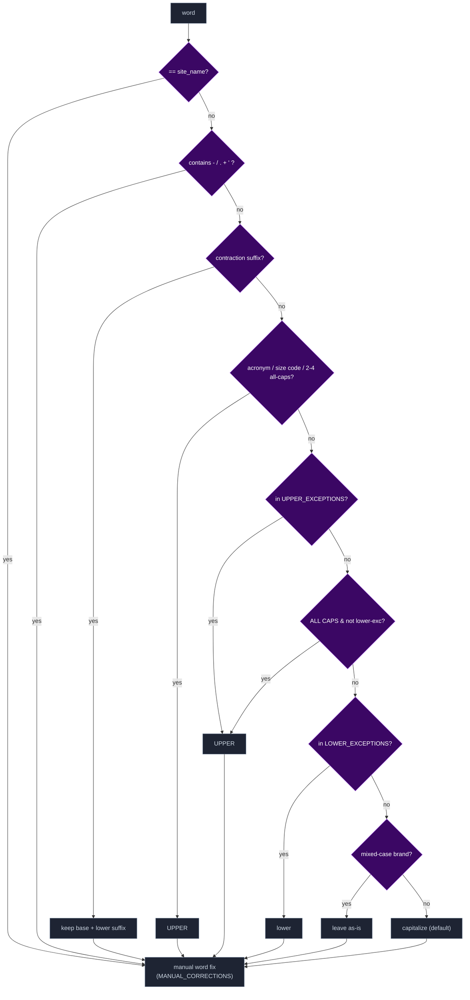

### A.3 Rule Tables (Data That Drives Behavior)

| Table | Purpose | Examples |
|---|---|---|
| `LOWER_EXCEPTIONS` | small words kept lowercase mid-title | of, the, and, vs |
| `TLD_FRAGMENTS` | lowercased only as a domain suffix, else normal words | co, com, org |
| `SPANISH_LOWER_EXCEPTIONS` / `SPANISH_SITE_KEYS` | Spanish small words, applied on Spanish-language sites | de, del, con / fakings, sexmex |
| `UPPER_EXCEPTIONS` | force uppercase | bbc, xxx, pov, milf, usa |
| `ACRONYMS` / `SIZE_CODES` | uppercase tech/size tokens | vr, hd, 4k / xs, xl, xxl |
| `CONTRACTIONS` | suffixes kept lowercase after an apostrophe | 're, 't, 'll, 've |
| `HONORIFICS` / `ROMAN_NUMERALS` | grammar-pass period fix / sequence-number detection | mr, dr / ii, iv, xii |
| `INITIAL_PAIRS` | two-letter stage names kept as initials | AJ → A.J., TJ → T.J. |
| `SYMBOL_RULES` | how `- / . + '` split + rejoin | `.`→initials/acronym, `'`→contraction |
| `MANUAL_CORRECTIONS` | exact restylings | mccray→McCray, milfs→MILFs, espanol→Español |
| `CONTRACTION_CORRECTIONS` | apostrophe restoration, skipped for `type='name'` | dont→Don't, doesnt→Doesn't, aint→Ain't |
| `START_CONTRACTIONS` | clause-initial only, where the word is ambiguous mid-title | Lets Play→Let's Play, Its Been→It's Been |
| `SCRAPER_PHRASE_CORRECTIONS` | per-scraper phrase restylings | strike3: a game→A Game |
| `NAME_EXCEPTION_SITES` | site-specific name casing | JavBus, JAVDatabase |

These tables are functional config consumed inline by the engine, so they live in
`title_case.py` rather than in `_data/json`.

### A.4 Robustness — ReDoS Guard

The post-process stage includes O(n²) passes that backtrack badly on long
whitespace-free input. Real titles/names are short, so `title_case()` caps input
at `MAX_TITLE_LENGTH` (1000) before parsing — this bounds the worst case to
~1e6 ops (instant) and removes the event-loop-block DoS without altering output
for realistic inputs.

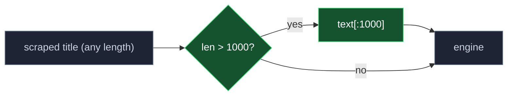

### A.5 Companion Helpers (Module Exports)

```mermaid
flowchart LR
  classDef u fill:#1e2433,stroke:#64748b,color:#cbd5e1;
  t["title"]:::u
  art["strip leading article<br/>(The/A/An)"]:::u
  conv["_convert_bounded_numbers<br/>(spelled-out → digits, only<br/>touching a sequence marker)"]:::u
  ts["title_sort → sort value | None"]:::u
  csn["convert_sequence_numbers → digits | None"]:::u

  t --> art --> conv --> ts
  t --> conv --> csn
```

Beyond `title_case()`, the module exports helpers used by the mapper and clients:

- `normalize_sequence_separator` — folds the separator before a numbered sequence marker into `: ` (`… - Scene 4` / `… (Part 2)` → `…: Scene 4` / `…: Part 2`); a marker word followed by a non-number is left alone. Applied automatically for `type='title'`.
- `title_sort` — Plex `titleSort` value: strips the leading article and digit-converts marker-bounded spelled-out numbers (`Episode Twelve` → `Episode 12`, via `text2digits`); returns `None` when it wouldn't differ. Emitted by the mapper and backfilled into cached snapshots.
- `convert_sequence_numbers` — the digit conversion alone, no article strip; also `None` on no change. Used in title-similarity scoring and data18's search fallback.
- `collapse_initial_pairs` / `expand_initial_pairs` — round-trip `A. J.` ↔ `A.J.` so spacing passes can't split known two-letter stage names (`INITIAL_PAIRS`); also used directly by clients that rebuild summaries (e.g. `pornbox`).

---

*Diagrams render in the repo's Markdown viewer (Mermaid — supported on both GitHub and Codeberg). Update them alongside the code they model — a stale model is worse than none.*
