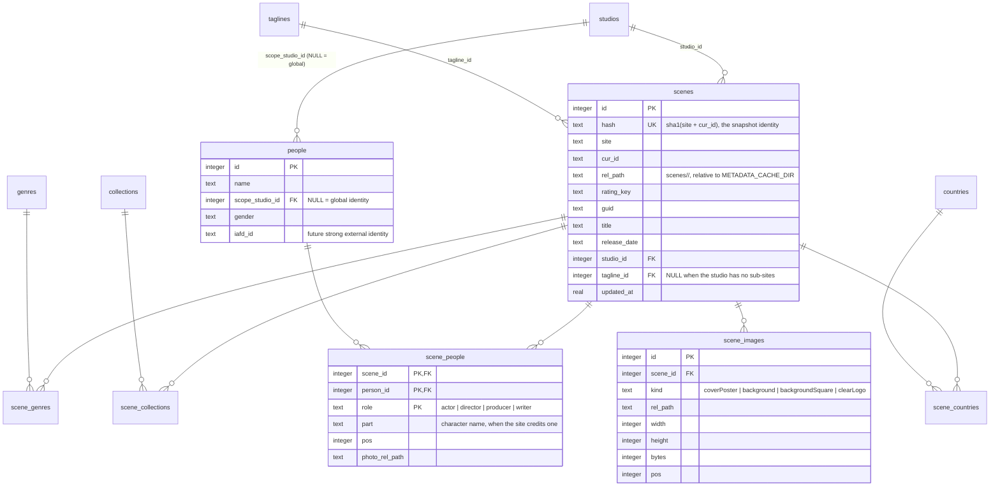
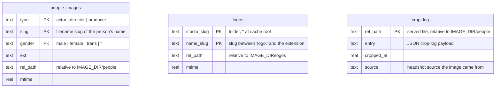
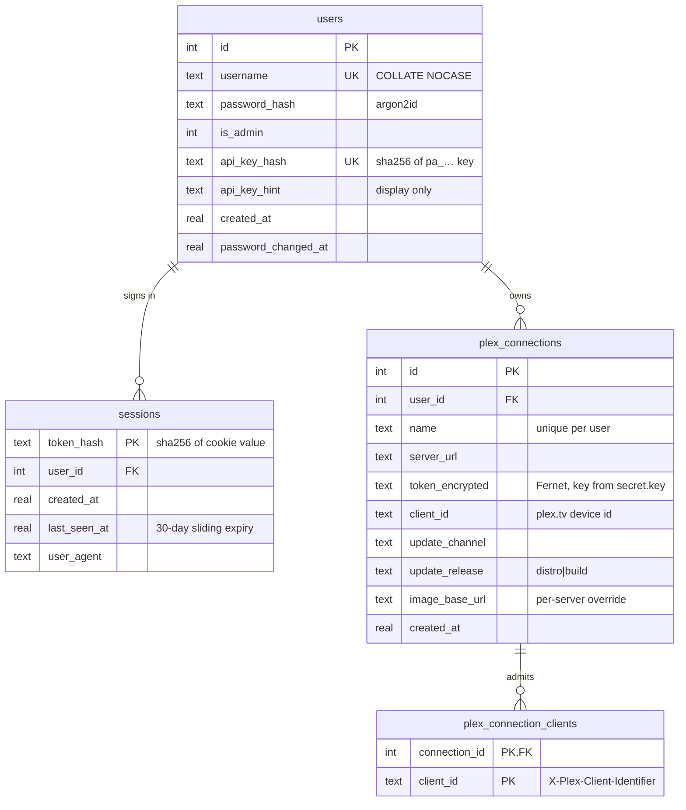

# Database Design (phoenixadult.db)

All mutable application state that used to live in flat files lives in a single
SQLite database, `phoenixadult.db` (`STATE_DB_PATH`, default `./local/phoenixadult.db`). This document
covers the engine choice, the schema, the reasoning behind its shape, and the operational
lifecycle (backup, rebuild).

## Engine & Pragma Choices

**SQLite via the standard-library `sqlite3` module.** No server to run, no pip
dependency, no extra FreeBSD package beyond `py-sqlite3` (FreeBSD splits the module out
of `lang/python`). The app is a single process, so client/server engines (Postgres,
MySQL/MariaDB) would add a daemon and provisioning burden to solve concurrency problems
this workload does not have. Redis has the wrong durability model for primary data, and
distributed batch systems are orders of magnitude away from a ~6,000-row catalog.

Connection setup (`phoenixadult/utils/db/connect`):

| Pragma | Value | Why |
| --- | --- | --- |
| `journal_mode` | `WAL` | Crash-safe atomic transactions; readers never block the writer. Fixes the torn-write risk the JSON stores had. |
| `synchronous` | `NORMAL` | The right durability/latency trade-off under WAL — a power loss can lose the last transaction(s) but never corrupts the file. |
| `foreign_keys` | `ON` | SQLite defaults FK enforcement off; the scene tables rely on it (`ON DELETE CASCADE` junction cleanup). |
| `busy_timeout` | `5000` | Concurrent writers wait for the lock instead of raising `database is locked`. |

**Connections are per-thread.** A `sqlite3.Connection` tolerates use from another thread
(`check_same_thread=False`) but is not safe for *concurrent* use — two threads inside `execute()`
on one handle raise `InterfaceError: bad parameter or other API misuse`. Serving reads the cache
through `asyncio.to_thread`, so every worker gets its own connection, tracked in a registry that
`close()` drains together (a stale handle in a worker would otherwise pin a swapped-out database
file). Opening is serialized under a lock: switching a fresh database to WAL needs a lock that
`busy_timeout` does not wait out, so the first connection sets it and the rest find it set.

`force_refresh` is a one-shot flag, not stored state: a people-cache edit sets it on every scene
crediting that performer, and the next serve consumes it to rebuild their headshot URLs. The
snapshot upsert deliberately omits the column, so rewriting a scene never clears a pending flag.

Schema versioning uses `PRAGMA user_version` with a linear, append-only migration list
(`_MIGRATIONS` in `phoenixadult/utils/db/__init__.py`). A migration script is never edited after
it ships; changes append a new version.

## Design Principle

Image, headshot, and logo **bytes stay on disk** — they are served via
`FileResponse`/sendfile and back up trivially with rsync/zfs. Derived stores (search
cache, queue replays) stay rebuildable-or-expendable, so their loss never costs data.
The **scene store is the exception**: it is primary data — snapshots are expensive to
recreate under anti-ban pacing — so it gets first-class backup support (`VACUUM INTO`,
below).

## Schema Version 1 — Queue Replays & Search Store

Derived state — re-derivable by re-scraping, so no permanent data loss on deletion,
though rebuilding the search store means re-searching every title under anti-ban pacing.

- `queue_replays(key PK, replay JSON, queued_at)` — one row per queued background
  scrape, replacing the whole-file rewrite of `queue-state.json`.
- `searches(key_hash PK, site, title, date, scene_id, language, saved_at)` +
  `search_results(key_hash FK, pos, cur_id, title, subsite, payload JSON)` — the
  search store; cached results are perpetual by default (`SEARCH_STORE_TTL_DAYS=0`).
  `load_similar` and `find_title` are indexed lookups instead of per-call directory scans.

## Schema Version 2 — the Scene Store

One row per snapshotted scene, fully normalized: scalar fields inline on `scenes`,
one-to-many lookups in dimension tables (`studios`, `taglines`), many-to-many fields in
dimension + junction pairs (`genres`, `collections`, `countries`, `people`), and image
metadata in `scene_images` (the bytes stay in the per-scene folder on disk).
The serve path assembles `PlexMetadataResponse` straight from these tables, and the
scrape path decomposes each snapshot into them in a single transaction
(`phoenixadult/utils/cache/scene_store.py`).

### Entity-Relationship Diagram



### Full DDL

```sql
CREATE TABLE studios (
  id   INTEGER PRIMARY KEY,
  name TEXT NOT NULL UNIQUE
);
CREATE TABLE taglines (
  id   INTEGER PRIMARY KEY,
  name TEXT NOT NULL UNIQUE
);
CREATE TABLE genres (
  id   INTEGER PRIMARY KEY,
  name TEXT NOT NULL UNIQUE
);
CREATE TABLE collections (
  id   INTEGER PRIMARY KEY,
  name TEXT NOT NULL UNIQUE
);
CREATE TABLE countries (
  id   INTEGER PRIMARY KEY,
  name TEXT NOT NULL UNIQUE
);
CREATE TABLE scenes (
  id              INTEGER PRIMARY KEY,
  hash            TEXT NOT NULL UNIQUE,
  site            TEXT NOT NULL,
  cur_id          TEXT NOT NULL,
  rel_path        TEXT NOT NULL,
  identifier      TEXT NOT NULL,
  rating_key      TEXT NOT NULL,
  guid            TEXT NOT NULL,
  title           TEXT NOT NULL,
  title_sort      TEXT,
  original_title  TEXT,
  summary         TEXT,
  release_date    TEXT,
  year            INTEGER,
  duration        INTEGER,
  rating          REAL,
  audience_rating REAL,
  content_rating  TEXT,
  is_adult        INTEGER,
  data18_type     TEXT,
  data18_id       TEXT,
  data18_manual   INTEGER NOT NULL DEFAULT 0,
  data18_also     TEXT NOT NULL DEFAULT '',
  thumb           TEXT,
  art             TEXT,
  studio_id       INTEGER REFERENCES studios(id),
  tagline_id      INTEGER REFERENCES taglines(id),
  updated_at      REAL NOT NULL,
  force_refresh   INTEGER NOT NULL DEFAULT 0
);
CREATE INDEX scenes_rel ON scenes(rel_path);
CREATE INDEX scenes_updated ON scenes(updated_at);
CREATE INDEX scenes_force ON scenes(force_refresh) WHERE force_refresh = 1;
CREATE TABLE scene_genres (
  scene_id INTEGER NOT NULL REFERENCES scenes(id) ON DELETE CASCADE,
  genre_id INTEGER NOT NULL REFERENCES genres(id),
  pos      INTEGER NOT NULL,
  PRIMARY KEY (scene_id, genre_id)
);
CREATE TABLE scene_collections (
  scene_id      INTEGER NOT NULL REFERENCES scenes(id) ON DELETE CASCADE,
  collection_id INTEGER NOT NULL REFERENCES collections(id),
  pos           INTEGER NOT NULL,
  PRIMARY KEY (scene_id, collection_id)
);
CREATE TABLE scene_countries (
  scene_id   INTEGER NOT NULL REFERENCES scenes(id) ON DELETE CASCADE,
  country_id INTEGER NOT NULL REFERENCES countries(id),
  pos        INTEGER NOT NULL,
  PRIMARY KEY (scene_id, country_id)
);
CREATE TABLE people (
  id              INTEGER PRIMARY KEY,
  name            TEXT NOT NULL,
  scope_studio_id INTEGER REFERENCES studios(id),
  gender          TEXT NOT NULL DEFAULT '',
  iafd_id         TEXT,
  UNIQUE (name, scope_studio_id)
);
CREATE UNIQUE INDEX people_global ON people(name) WHERE scope_studio_id IS NULL;
CREATE TABLE scene_people (
  scene_id       INTEGER NOT NULL REFERENCES scenes(id) ON DELETE CASCADE,
  person_id      INTEGER NOT NULL REFERENCES people(id),
  role           TEXT NOT NULL,
  part           TEXT,
  pos            INTEGER NOT NULL,
  photo_rel_path TEXT,
  PRIMARY KEY (scene_id, person_id, role)
);
CREATE TABLE scene_images (
  id       INTEGER PRIMARY KEY,
  scene_id INTEGER NOT NULL REFERENCES scenes(id) ON DELETE CASCADE,
  kind     TEXT NOT NULL,
  rel_path TEXT NOT NULL,
  width    INTEGER,
  height   INTEGER,
  bytes    INTEGER,
  pos      INTEGER NOT NULL,
  priority INTEGER NOT NULL DEFAULT 0
);
CREATE INDEX scene_images_scene ON scene_images(scene_id);
```

## Schema Version 3 — People-Image Index, Logo Index, and Crop Log

Derived state over files that remain the source of truth. These three tables replace the
last of the throttled directory rescans:

- `people_images` — one row per served headshot in the people cache
  (`IMAGE_DIR/people`), keyed `(type, slug, gender)` from the `role.slug[_gender].ext`
  filename convention. Replaces the 30-second full-tree rescan behind `lookup_cached`
  with a keyed SELECT; rows are maintained inline by every write, gender move, restore,
  and purge. A lookup miss falls back to a bounded scan of the type's subfolders, so a
  manually-dropped file is found immediately and its row self-heals.
- `logos` — one row per cached clearLogo file (`<studio_slug>/logo.<name_slug>.<ext>`
  under `IMAGE_DIR/logos`), keyed `(studio_slug, name_slug)`. `find_logo` tries the
  tagline slug then the studio slug as two keyed SELECTs (lowest `rel_path` wins on
  duplicates, matching the old first-file-wins scan order); downloads insert their row.
- `crop_log` — the per-headshot record. `rel_path` is the served file's path relative
  to the people cache root; `entry` keeps the JSON payload (name, filenames, upstream
  URL, cropped flag) and `source` names where the image came from (`IAFD`, `Scene`,
  `Generic`, …). The preserved pre-crop originals stay files under `originals/`.

Reconciliation: at startup (and lazily on first use after a cache-dir or database
change) the index tables are rebuilt from one directory walk. Deleting `phoenixadult.db`
rebuilds both indexes at the next boot; only the crop-log history is lost.



```sql
CREATE TABLE people_images (
  type     TEXT NOT NULL,
  slug     TEXT NOT NULL,
  gender   TEXT NOT NULL DEFAULT '',
  ext      TEXT NOT NULL,
  rel_path TEXT NOT NULL,
  mtime    REAL NOT NULL,
  PRIMARY KEY (type, slug, gender)
);
CREATE TABLE logos (
  studio_slug TEXT NOT NULL DEFAULT '',
  name_slug   TEXT NOT NULL,
  rel_path    TEXT NOT NULL,
  mtime       REAL NOT NULL,
  PRIMARY KEY (studio_slug, name_slug)
);
CREATE INDEX logos_name ON logos(name_slug);
CREATE TABLE crop_log (
  rel_path   TEXT PRIMARY KEY,
  entry      TEXT NOT NULL,
  cropped_at REAL NOT NULL,
  source     TEXT NOT NULL DEFAULT ''
);
```

## Schema Version 5 — Headshot Sources

`crop_log.source` records which headshot source produced each cached image, so the
people UI can say where a face came from and a bulk re-fetch can be aimed at one
source's images. It is written by `cache_photo`: callers that know the source pass it
(`Scene` for the scene page's own actor image, `Generic` for the silhouette, the source
name for a provider hit or a Fetch From), and anything else is derived from the image
host by `source_for_url` (`phoenixadult/utils/people/image_source.py`).

The column is authoritative and the JSON `entry` blob never carries a source; readers in
`face_crop_log` fold the column into the dict they return.

Existing rows were backfilled at migration time from their stored `upstream_url`. A URL
no source claims is recorded as `Scene`: before this version the cache only ever wrote a
people-source image, the scene page's image, or the silhouette, so an unclaimed host was
a scene image by elimination. This is the first migration step that is a Python callable
rather than a SQL script — `_MIGRATIONS` accepts either.

## Schema Version 6 — Manual Data18 References

`scenes.data18_also` holds any extra Data18 page IDs, comma-joined; a manual mapping's `"also"`
list lands here and round-trips through the snapshot as `data18.also`, so image enrichment can walk
a feature split across several pages, primary first.

`scene_images.priority` marks artwork that outranks resolution when the snapshot is reassembled —
each kind serves flagged rows first, then largest-first as before. Data18 movie covers (front, back,
poster) are flagged at scrape time, so a real DVD cover beats a bigger gallery still and becomes the
thumb. It round-trips through the snapshot as `priority` on the image entry, set only when true.

`scenes.data18_manual` marks a Data18 reference typed into the snapshot editor rather than resolved
by a scrape, giving the reference three states: blank (no id), filled (scraped) and manual. The
`/metadata` Data18 filter reads it, so hand-made mappings can be listed and exported on their own.
It round-trips through the snapshot as `data18.manual`, set only when true.

## Schema Version 13 — Accounts, Sessions, and Plex Connections

Authentication and Plex pairing move out of the environment and into the database, so the provider
can serve several people and several Plex servers at once.



```sql
CREATE TABLE users (
  id                  INTEGER PRIMARY KEY,
  username            TEXT NOT NULL UNIQUE COLLATE NOCASE,
  password_hash       TEXT NOT NULL,
  is_admin            INTEGER NOT NULL DEFAULT 0,
  api_key_hash        TEXT UNIQUE,
  api_key_hint        TEXT NOT NULL DEFAULT '',
  created_at          REAL NOT NULL,
  password_changed_at REAL NOT NULL
);
CREATE TABLE sessions (
  token_hash   TEXT PRIMARY KEY,
  user_id      INTEGER NOT NULL REFERENCES users(id) ON DELETE CASCADE,
  created_at   REAL NOT NULL,
  last_seen_at REAL NOT NULL,
  user_agent   TEXT NOT NULL DEFAULT ''
);
CREATE INDEX sessions_user ON sessions(user_id);
CREATE TABLE plex_connections (
  id              INTEGER PRIMARY KEY,
  user_id         INTEGER NOT NULL REFERENCES users(id) ON DELETE CASCADE,
  name            TEXT NOT NULL,
  server_url      TEXT NOT NULL DEFAULT '',
  token_encrypted TEXT NOT NULL DEFAULT '',
  client_id       TEXT NOT NULL DEFAULT '',
  update_channel  TEXT NOT NULL DEFAULT 'plex',
  update_release  TEXT NOT NULL DEFAULT '',
  image_base_url  TEXT NOT NULL DEFAULT '',
  created_at      REAL NOT NULL,
  UNIQUE (user_id, name)
);
CREATE INDEX plex_connections_user ON plex_connections(user_id);
CREATE TABLE plex_connection_clients (
  connection_id INTEGER NOT NULL REFERENCES plex_connections(id) ON DELETE CASCADE,
  client_id     TEXT NOT NULL,
  PRIMARY KEY (connection_id, client_id)
);
CREATE INDEX plex_connection_clients_client ON plex_connection_clients(client_id);
```

Only reversible secret in the schema is `token_encrypted` — Plex replays that token on every call,
so it cannot be hashed. It is encrypted with a key derived from `secret.key` (written beside the
database, never stored in it), which means a stolen database or backup alone does not yield a
usable Plex token. Passwords, API keys, and session cookies are one-way digests.

Allowed client identifiers are a child table rather than a delimited column because the provider
guard needs the **union across every user's connections** on each request; `SELECT DISTINCT` over an
indexed column beats parsing strings in the hot path. An empty union leaves the provider open, which
is what keeps a fresh install (and an upgrade that has not configured anything yet) serving Plex.

Deleting a user cascades to their sessions and connections, and deleting a connection cascades to
its client identifiers, so account removal leaves nothing behind.

## Schema Version 14 — Per-User Themes and Enrichment Tokens

Three columns join `users`, all defaulting to empty:

```sql
ALTER TABLE users ADD COLUMN theme_dark TEXT NOT NULL DEFAULT '';
ALTER TABLE users ADD COLUMN theme_light TEXT NOT NULL DEFAULT '';
ALTER TABLE users ADD COLUMN metadataapi_token_encrypted TEXT NOT NULL DEFAULT '';
```

`theme_dark`/`theme_light` hold the account's chosen theme per mode — saved from the
Config UI's Theme tab and injected at page render, so a selection follows the account
across browsers and never affects anyone else's. `metadataapi_token_encrypted` is the
user's ThePornDB bearer token, Fernet-encrypted with the same `secret.key` derivation
as Plex tokens; scrapes resolve it from the requesting user (admin UIs) or the owner
of the matched Plex connection (provider traffic), falling back to the first
configured token for background work.

## Why This Shape

### Why Dimension + Junction Tables

Genres, collections, countries, and people are many-to-many with scenes. Junction
tables give each fact exactly one home:

- **Rename/recase is one row.** Renaming a studio or recasing a collection is a single
  `UPDATE ... SET name` in the dimension table — the exact pain of the Nubile Films
  rename and the Cum-on-X recases, which previously meant rewriting thousands of JSON
  files (`scripts/rename_studio.py`).
- **Deduplicated with referential integrity.** "Every scene in collection X" is a
  `SELECT` over a junction, not a full-tree scan.
- Columns on the scene row would be the classic normalization failure: a scene has many
  actors, so actor columns either cap the cast or stuff lists into one cell.

### One Spelling Per Name

Every dimension name is unique **ignoring capitalisation**, enforced by a `COLLATE NOCASE`
unique index on each of `people`, `studios`, `taglines`, `collections`, `genres` and
`countries` (`people` keeps separate global and studio-scoped indexes). Lookups match the
same way, so a scrape that supplies a different capitalisation reuses the existing row.

This matters because `title_case` preserves capitals it did not introduce: a site sending
`McKenna Lynn` keeps that spelling, while one sending `mckenna lynn` yields `Mckenna Lynn`.
Under the old case-sensitive `UNIQUE` both became separate rows with the credits split
between them.

**The stored spelling is sticky.** A later scrape with different capitalisation never
rewrites it, so casing cannot flip back and forth between two sites. Changing a stored
spelling is a deliberate act — `scripts/rename_studio.py "old" "new"` recases in place when
the two differ only by capitalisation, and merges when the target already exists. Use it
after a `title_case` rule change to bring stored names in line.

Installs from before this rule are folded by the v7 migration, which keeps the row that
scenes actually reference (lowest id when both are used) and repoints every credit onto it.

A `title_case` rule change can also strand a spelling: once honorifics gained a period,
`Mz Dani` and `Mz. Dani` were two rows. The v8 migration folds any pair whose names collapse
to the same string once `title_case` is applied, keeping the canonical spelling, carrying
`gender` and `iafd_id` onto it when the survivor has neither, and repointing every credit.
It deliberately will not touch genuine variants — `Glory Hole` and `Gloryhole` both survive
`title_case` unchanged, so choosing between them stays an editorial decision.

A stranded spelling with no canonical twin used to stay wrong forever: a `Whitney Oc` row
stored before `title_case` learned the `Whitney OC` correction had nothing to fold into.
The v11 migration re-runs the v8 fold and then recases the surviving single rows in place
wherever `title_case` now disagrees with what is stored. Because `title_case` preserves
capitals it did not introduce, names it has no opinion on are untouched — the sticky-spelling
rule above still holds for everything else.

For **genres** the canonical authority is `genres.json`'s replace map, not `title_case` —
its values deliberately keep lowercase gender qualifiers (`Caucasian (female)`), which
`title_case` would capitalize. v11 got that wrong and recased the gender-qualified genre
rows away from what the scraper actually emits, so the Plex reconciler reported thousands
of false "recased" removals. The recase pass now resolves a genre through the replace map
first (falling back to `title_case` only for free-form tags), and the v12 migration re-runs
it to restore the mangled rows.

### Pruning Unreferenced Names

Dimension rows outlive the scenes that created them: a tag that `genres.json` later filters
out, a tagline from a purged snapshot, a performer whose only scene was deleted. **Prune
Unused Names** in the metadata UI (`POST /metadata/prune-names`) deletes every row in the six
dimension tables that no scene references, and reports the count per table. Nothing is lost
permanently — a name reappears the moment a scene credits it again — but curated
per-person data (gender, `iafd_id`, a cached headshot) goes with the row, so an orphaned
person is worth reviewing in the people UI first. The single-name filter there exists for
exactly that: short names collide easily and are usually better replaced with a fuller one.

Each junction carries `pos`, preserving the emitted order of the original response so a
reassembled snapshot is byte-for-byte faithful (order is meaningful — the first
collection and the actor billing order matter to Plex).

### Why Not a Star Schema

The layout *looks* star-like (scene at the center, lookups around it), but a star schema
is a warehouse/analytics pattern: an append-only fact table of events with denormalized
dimensions and **no junction tables**, optimized for aggregate queries. This store has
many-to-many junctions, in-place updates, and serve-time point reads — it is a
normalized OLTP schema, not a star.

### Why Not One Shared Tags Table

Plex itself uses a single `tags` table with a `tag_type` discriminator. Rejected here:
genres, collections, countries, and people have different shapes (people carry gender,
scope, and an external id; tags do not), different growth rates, and different
maintenance operations. One shared table would force `WHERE tag_type = ?` on every
query, weaken FK targets (any junction could reference any tag type), and make the
person-specific columns NULL noise on every genre row.

### One People Table, Role on the Junction

A person is one identity regardless of function: Stoney Curtis is one `people` row;
his acting, directing, and producing credits are three `scene_people` rows differing
only in `role`. Three per-type tables would store him thrice and turn "everything this
person did" into a 3-way UNION. `role` describes the scene↔person relationship, so it
lives on the junction, never on the person. `part` keeps the credited character name
when a site provides one.

## Scoped People Resolution

`people` supports two kinds of identity:

- **Global row** — `scope_studio_id IS NULL`. The default: new names always create a
  global row.
- **Studio-scoped row** — `scope_studio_id` set. An operator-created override that wins
  for that studio's scenes and carries its own gender/photo/iafd_id.

When linking a person to a scene, resolution prefers `(name, scene's studio)`; if no
scoped row exists, the global row is used or created. Two "Amanda"s coexist: the scoped
row claims its studio's scenes, every other studio keeps the global row. An operator
"splits" a collision by inserting a scoped row and re-linking that studio's
`scene_people` rows (small maintenance query; future UI candidate).

SQLite nuance: `UNIQUE (name, scope_studio_id)` treats NULLs as distinct, so global
uniqueness needs the partial unique index (`WHERE scope_studio_id IS NULL`) alongside
the composite constraint.

`iafd_id` is reserved as the strong external identity: scoped and global rows for the
same performer can later be merged by matching it. Same-name-different-person policy is
otherwise unchanged from the file era — the per-studio alias tables (`replace_studios`
in `actors.json`, applied by `apply_name_aliases` before resolution) disambiguate at
name level, and distinct `people` rows fall out naturally.

## Snapshot Folder Layout

Each snapshot owns one folder, addressed **only** by its scene hash:

```
<METADATA_CACHE_DIR>/scenes/<first two hex chars>/<12-char hash>/
    snapshot.json
    images/poster-00.jpg …
```

The hash is `sha1(site-slug \n cur_id)[:12]`, so the path depends on the scene's identity
and nothing else. Renaming a studio, recasing a tagline or reclassifying a site never
moves a folder and never invalidates a stored image URL — `scripts/rename_studio.py` is a
dimension `UPDATE` and nothing more. The two-character bucket keeps directory widths even
by construction (256 buckets; ~33 folders each at 8k scenes).

`snapshot.json` makes each folder self-describing: the scene's site, `cur_id`, hash, the
full served response and every image's dimensions. `scripts/rebuild_from_bundles.py`
restores the `scenes` rows and all their junctions from those files alone, so the tree
survives a lost database. Installs from before this layout are moved by
`scripts/migrate_snapshot_layout.py` (dry run by default, `--apply` to migrate,
`--prune-orphans` to also drop folders and image rows nothing points at); the server logs
a warning at startup while any snapshot is still on the old layout.

## Image Handling

Image **bytes** stay in the per-scene folder (`<METADATA_CACHE_DIR>/<rel_path>/images/`),
written by the existing temp-dir + rename download flow and served by the `/cache`
route. `scene_images` records what the folder holds: classified `kind`, stored URL
(`rel_path`), dimensions, byte size, and position.

- **At snapshot write**, dimensions come free from the image fetcher. A rewrite keeps
  images already inside the snapshot tree in place — same names, same bytes, dimensions
  re-probed locally — so backfill rewrites never re-download or renumber artwork.
- **Solid-colour images are dropped, never stored.** Sites sometimes serve a flat black or
  white placeholder in place of real artwork. The fetcher measures each image's channel
  extrema on a drafted decode and flags anything whose spread is ≤ 4 as solid; the snapshot
  write skips it, and a rewrite deletes one that a previous version had already stored.
  When the dropped image was the `thumb` or `art`, the largest surviving image of that same
  kind takes its place; a scene ends up with no poster only when nothing of that kind is
  left. A scene that never had a `thumb` does not gain one.
  The margin is wide (a genuinely solid image measures 0; the faintest real detail measures
  in the teens), so a dark-but-real image is not at risk. Every drop is logged with its URL.
  `scripts/find_artwork_mismatches.py` reports snapshots still holding one.
- **At serve**, each image kind is emitted highest resolution first (`width × height`
  descending, unknown dimensions last); fresh scrapes apply the same ordering in the
  mapper from the just-probed dimensions, and the highest-resolution poster becomes the
  `thumb`.

## Legacy Migration (Historical)

Releases up to `1.0.0a124` carried one-time importers that folded the pre-database
files (per-scene `meta.json`, per-key search JSONs, `queue-state.json`, per-folder
`.face_crop_log.json`) into these tables at startup and retired each source file with a
`.migrated` suffix. Those importers were removed once the migration shipped: an install
upgrading from a pre-database release must run `1.0.0a124` once first (or accept
starting with an empty scene store). Leftover `.migrated` files are inert rollback
artifacts, deletable whenever the operator is satisfied — `phoenixadult.db` is the only live
copy of the scene text and must be backed up.

Snapshot writes are idempotent upserts keyed on `hash` (`UNIQUE` — this is also what
prevents duplicate snapshots of the same scene). A crash between the image-folder
rename and the row commit leaves only orphan image files, which the next write of that
scene replaces.

## Corruption Prevention

WAL mode keeps a shared-memory index (`-shm`) and relies on POSIX byte-range locks that
assume a **single host** with a coherent view of the file. Put the database on storage
only this process touches. A network mount (NFS/SMB), or a local path **exported** over
SMB so another machine (a Windows indexer, antivirus, a backup job, a file browser) can
open it, breaks that assumption and tears the WAL — the classic "database disk image is
malformed" / freelist corruption. The image and metadata trees are plain files and are
fine on a share; only `*.db`/`-wal`/`-shm` must stay private to the process.

## Backups & Self-Healing (App-Driven)

The app writes its own `VACUUM INTO` snapshots on a timer — no cron. Every
`DB_BACKUP_INTERVAL_HOURS` (and once at first boot) it snapshots the database to
`DB_BACKUP_DIR` (default `backups/` beside `STATE_DB_PATH`), keeping `DB_BACKUP_KEEP`
generations. `VACUUM INTO` is transactionally consistent while serving and preserves
`user_version`.

On startup the app runs `PRAGMA quick_check` on the live database. If it fails, the
corrupt file is quarantined (`*.corrupt-<timestamp>`) and the newest snapshot that passes
its own integrity check is restored automatically — corruption becomes a logged, self-
healed event rather than a boot loop. With no valid backup, the corrupt file is left in
place for manual repair (`sqlite3 phoenixadult.db ".recover"`; the derived stores otherwise
rebuild by re-scraping). A manual one-off snapshot is still just:

```sh
sqlite3 ./local/phoenixadult.db "VACUUM INTO './backups/phoenixadult-$(date +%Y%m%d).db'"
```

## Rebuild & Reconciliation Semantics

- **Version-1 tables** (queue replays, search store) are derived: deleting `phoenixadult.db`
  loses no permanent data — replays are re-queued by the next scan, and the search store
  (perpetual by default) re-populates as titles are searched again under pacing.
- **Version-3 tables** (people-image index, logo index) are derived from the image
  trees and rebuild from one directory walk at the next startup; the crop log has no
  file source, so a database loss loses its history.
- **Scene tables** are primary data: a lost database means re-scraping every scene
  under anti-ban pacing. Back up with `VACUUM INTO` (above).
- Destructive drop-and-rebuild stays a legal escape hatch for derived tables during
  schema churn; the scene tables migrate forward only, via appended `user_version`
  scripts.
