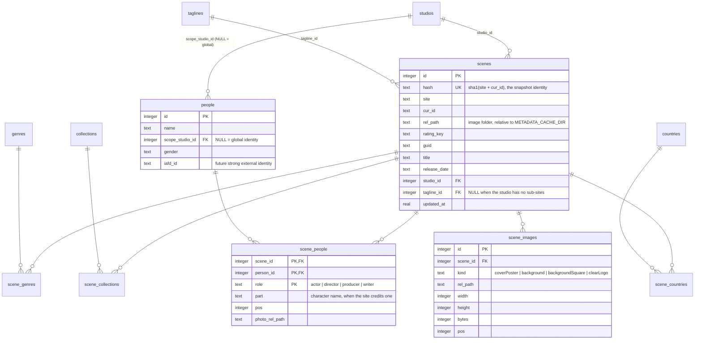
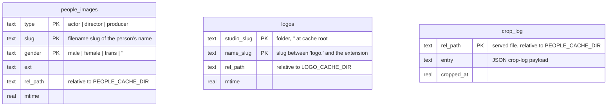

# Database Design (phoenixadult.db)

All mutable application state that used to live in flat files lives in a single
SQLite database, `phoenixadult.db` (`STATE_DB_PATH`, default `./local/phoenixadult.db`). This document
covers the engine choice, the schema, the reasoning behind its shape, and the operational
lifecycle (backup, rebuild).

## Engine & Pragma Choices

**SQLite via the standard-library `sqlite3` module.** No server to run, no pip
dependency, no extra FreeBSD package beyond `py-sqlite3` (FreeBSD splits the module out
of `lang/python`). The app is a single process, so client/server engines (Postgres,
MySQL/MariaDB) would add a daemon and provisioning burden to solve concurrency problems
this workload does not have. Redis has the wrong durability model for primary data, and
distributed batch systems are orders of magnitude away from a ~6,000-row catalog.

Connection setup (`phoenixadult/utils/db/connect`):

| Pragma | Value | Why |
| --- | --- | --- |
| `journal_mode` | `WAL` | Crash-safe atomic transactions; readers never block the writer. Fixes the torn-write risk the JSON stores had. |
| `synchronous` | `NORMAL` | The right durability/latency trade-off under WAL — a power loss can lose the last transaction(s) but never corrupts the file. |
| `foreign_keys` | `ON` | SQLite defaults FK enforcement off; the scene tables rely on it (`ON DELETE CASCADE` junction cleanup). |

Schema versioning uses `PRAGMA user_version` with a linear, append-only migration list
(`_MIGRATIONS` in `phoenixadult/utils/db/__init__.py`). A migration script is never edited after
it ships; changes append a new version.

## Design Principle

Image, headshot, and logo **bytes stay on disk** — they are served via
`FileResponse`/sendfile and back up trivially with rsync/zfs. Derived stores (search
cache, queue replays) stay rebuildable-or-expendable, so their loss never costs data.
The **scene store is the exception**: it is primary data — snapshots are expensive to
recreate under anti-ban pacing — so it gets first-class backup support (`VACUUM INTO`,
below).

## Schema Version 1 — Queue Replays & Search Store

Derived state — re-derivable by re-scraping, so no permanent data loss on deletion,
though rebuilding the search store means re-searching every title under anti-ban pacing.

- `queue_replays(key PK, replay JSON, queued_at)` — one row per queued background
  scrape, replacing the whole-file rewrite of `queue-state.json`.
- `searches(key_hash PK, site, title, date, scene_id, language, saved_at)` +
  `search_results(key_hash FK, pos, cur_id, title, subsite, payload JSON)` — the
  search store; cached results are perpetual by default (`SEARCH_STORE_TTL_DAYS=0`).
  `load_similar` and `find_title` are indexed lookups instead of per-call directory scans.

## Schema Version 2 — the Scene Store

One row per snapshotted scene, fully normalized: scalar fields inline on `scenes`,
one-to-many lookups in dimension tables (`studios`, `taglines`), many-to-many fields in
dimension + junction pairs (`genres`, `collections`, `countries`, `people`), and image
metadata in `scene_images` (the bytes stay in the per-scene folder on disk).
The serve path assembles `PlexMetadataResponse` straight from these tables, and the
scrape path decomposes each snapshot into them in a single transaction
(`phoenixadult/utils/cache/scene_store.py`).

### Entity-Relationship Diagram



### Full DDL

```sql
CREATE TABLE studios (
  id   INTEGER PRIMARY KEY,
  name TEXT NOT NULL UNIQUE
);
CREATE TABLE taglines (
  id   INTEGER PRIMARY KEY,
  name TEXT NOT NULL UNIQUE
);
CREATE TABLE genres (
  id   INTEGER PRIMARY KEY,
  name TEXT NOT NULL UNIQUE
);
CREATE TABLE collections (
  id   INTEGER PRIMARY KEY,
  name TEXT NOT NULL UNIQUE
);
CREATE TABLE countries (
  id   INTEGER PRIMARY KEY,
  name TEXT NOT NULL UNIQUE
);
CREATE TABLE scenes (
  id              INTEGER PRIMARY KEY,
  hash            TEXT NOT NULL UNIQUE,
  site            TEXT NOT NULL,
  cur_id          TEXT NOT NULL,
  rel_path        TEXT NOT NULL,
  identifier      TEXT NOT NULL,
  rating_key      TEXT NOT NULL,
  guid            TEXT NOT NULL,
  title           TEXT NOT NULL,
  title_sort      TEXT,
  original_title  TEXT,
  summary         TEXT,
  release_date    TEXT,
  year            INTEGER,
  duration        INTEGER,
  rating          REAL,
  audience_rating REAL,
  content_rating  TEXT,
  is_adult        INTEGER,
  data18_type     TEXT,
  data18_id       TEXT,
  thumb           TEXT,
  art             TEXT,
  studio_id       INTEGER REFERENCES studios(id),
  tagline_id      INTEGER REFERENCES taglines(id),
  updated_at      REAL NOT NULL
);
CREATE INDEX scenes_rel ON scenes(rel_path);
CREATE INDEX scenes_updated ON scenes(updated_at);
CREATE TABLE scene_genres (
  scene_id INTEGER NOT NULL REFERENCES scenes(id) ON DELETE CASCADE,
  genre_id INTEGER NOT NULL REFERENCES genres(id),
  pos      INTEGER NOT NULL,
  PRIMARY KEY (scene_id, genre_id)
);
CREATE TABLE scene_collections (
  scene_id      INTEGER NOT NULL REFERENCES scenes(id) ON DELETE CASCADE,
  collection_id INTEGER NOT NULL REFERENCES collections(id),
  pos           INTEGER NOT NULL,
  PRIMARY KEY (scene_id, collection_id)
);
CREATE TABLE scene_countries (
  scene_id   INTEGER NOT NULL REFERENCES scenes(id) ON DELETE CASCADE,
  country_id INTEGER NOT NULL REFERENCES countries(id),
  pos        INTEGER NOT NULL,
  PRIMARY KEY (scene_id, country_id)
);
CREATE TABLE people (
  id              INTEGER PRIMARY KEY,
  name            TEXT NOT NULL,
  scope_studio_id INTEGER REFERENCES studios(id),
  gender          TEXT NOT NULL DEFAULT '',
  iafd_id         TEXT,
  UNIQUE (name, scope_studio_id)
);
CREATE UNIQUE INDEX people_global ON people(name) WHERE scope_studio_id IS NULL;
CREATE TABLE scene_people (
  scene_id       INTEGER NOT NULL REFERENCES scenes(id) ON DELETE CASCADE,
  person_id      INTEGER NOT NULL REFERENCES people(id),
  role           TEXT NOT NULL,
  part           TEXT,
  pos            INTEGER NOT NULL,
  photo_rel_path TEXT,
  PRIMARY KEY (scene_id, person_id, role)
);
CREATE TABLE scene_images (
  id       INTEGER PRIMARY KEY,
  scene_id INTEGER NOT NULL REFERENCES scenes(id) ON DELETE CASCADE,
  kind     TEXT NOT NULL,
  rel_path TEXT NOT NULL,
  width    INTEGER,
  height   INTEGER,
  bytes    INTEGER,
  pos      INTEGER NOT NULL
);
CREATE INDEX scene_images_scene ON scene_images(scene_id);
```

## Schema Version 3 — People-Image Index, Logo Index, and Crop Log

Derived state over files that remain the source of truth. These three tables replace the
last of the throttled directory rescans:

- `people_images` — one row per served headshot in the people cache
  (`PEOPLE_CACHE_DIR`), keyed `(type, slug, gender)` from the `role.slug[_gender].ext`
  filename convention. Replaces the 30-second full-tree rescan behind `lookup_cached`
  with a keyed SELECT; rows are maintained inline by every write, gender move, restore,
  and purge. A lookup miss falls back to a bounded scan of the type's subfolders, so a
  manually-dropped file is found immediately and its row self-heals.
- `logos` — one row per cached clearLogo file (`<studio_slug>/logo.<name_slug>.<ext>`
  under `LOGO_CACHE_DIR`), keyed `(studio_slug, name_slug)`. `find_logo` tries the
  tagline slug then the studio slug as two keyed SELECTs (lowest `rel_path` wins on
  duplicates, matching the old first-file-wins scan order); downloads insert their row.
- `crop_log` — the face-crop audit log. `rel_path` is the served file's path relative
  to the people cache root; `entry` keeps the JSON payload (name, filenames, upstream
  URL, cropped flag). The preserved pre-crop originals stay files under `originals/`.

Reconciliation: at startup (and lazily on first use after a cache-dir or database
change) the index tables are rebuilt from one directory walk. Deleting `phoenixadult.db`
rebuilds both indexes at the next boot; only the crop-log history is lost.



```sql
CREATE TABLE people_images (
  type     TEXT NOT NULL,
  slug     TEXT NOT NULL,
  gender   TEXT NOT NULL DEFAULT '',
  ext      TEXT NOT NULL,
  rel_path TEXT NOT NULL,
  mtime    REAL NOT NULL,
  PRIMARY KEY (type, slug, gender)
);
CREATE TABLE logos (
  studio_slug TEXT NOT NULL DEFAULT '',
  name_slug   TEXT NOT NULL,
  rel_path    TEXT NOT NULL,
  mtime       REAL NOT NULL,
  PRIMARY KEY (studio_slug, name_slug)
);
CREATE INDEX logos_name ON logos(name_slug);
CREATE TABLE crop_log (
  rel_path   TEXT PRIMARY KEY,
  entry      TEXT NOT NULL,
  cropped_at REAL NOT NULL
);
```

## Why This Shape

### Why Dimension + Junction Tables

Genres, collections, countries, and people are many-to-many with scenes. Junction
tables give each fact exactly one home:

- **Rename/recase is one row.** Renaming a studio or recasing a collection is a single
  `UPDATE ... SET name` in the dimension table — the exact pain of the Nubile Films
  rename and the Cum-on-X recases, which previously meant rewriting thousands of JSON
  files (`scripts/rename_studio.py`).
- **Deduplicated with referential integrity.** "Every scene in collection X" is a
  `SELECT` over a junction, not a full-tree scan.
- Columns on the scene row would be the classic normalization failure: a scene has many
  actors, so actor columns either cap the cast or stuff lists into one cell.

Each junction carries `pos`, preserving the emitted order of the original response so a
reassembled snapshot is byte-for-byte faithful (order is meaningful — the first
collection and the actor billing order matter to Plex).

### Why Not a Star Schema

The layout *looks* star-like (scene at the center, lookups around it), but a star schema
is a warehouse/analytics pattern: an append-only fact table of events with denormalized
dimensions and **no junction tables**, optimized for aggregate queries. This store has
many-to-many junctions, in-place updates, and serve-time point reads — it is a
normalized OLTP schema, not a star.

### Why Not One Shared Tags Table

Plex itself uses a single `tags` table with a `tag_type` discriminator. Rejected here:
genres, collections, countries, and people have different shapes (people carry gender,
scope, and an external id; tags do not), different growth rates, and different
maintenance operations. One shared table would force `WHERE tag_type = ?` on every
query, weaken FK targets (any junction could reference any tag type), and make the
person-specific columns NULL noise on every genre row.

### One People Table, Role on the Junction

A person is one identity regardless of function: Stoney Curtis is one `people` row;
his acting, directing, and producing credits are three `scene_people` rows differing
only in `role`. Three per-type tables would store him thrice and turn "everything this
person did" into a 3-way UNION. `role` describes the scene↔person relationship, so it
lives on the junction, never on the person. `part` keeps the credited character name
when a site provides one.

## Scoped People Resolution

`people` supports two kinds of identity:

- **Global row** — `scope_studio_id IS NULL`. The default: new names always create a
  global row.
- **Studio-scoped row** — `scope_studio_id` set. An operator-created override that wins
  for that studio's scenes and carries its own gender/photo/iafd_id.

When linking a person to a scene, resolution prefers `(name, scene's studio)`; if no
scoped row exists, the global row is used or created. Two "Amanda"s coexist: the scoped
row claims its studio's scenes, every other studio keeps the global row. An operator
"splits" a collision by inserting a scoped row and re-linking that studio's
`scene_people` rows (small maintenance query; future UI candidate).

SQLite nuance: `UNIQUE (name, scope_studio_id)` treats NULLs as distinct, so global
uniqueness needs the partial unique index (`WHERE scope_studio_id IS NULL`) alongside
the composite constraint.

`iafd_id` is reserved as the strong external identity: scoped and global rows for the
same performer can later be merged by matching it. Same-name-different-person policy is
otherwise unchanged from the file era — the per-studio alias tables (`replace_studios`
in `actors.json`, applied by `apply_name_aliases` before resolution) disambiguate at
name level, and distinct `people` rows fall out naturally.

## Image Handling

Image **bytes** stay in the per-scene folder (`<METADATA_CACHE_DIR>/<rel_path>/images/`),
written by the existing temp-dir + rename download flow and served by the `/cache`
route. `scene_images` records what the folder holds: classified `kind`, stored URL
(`rel_path`), dimensions, byte size, and position.

- **At snapshot write**, dimensions come free from the image fetcher. A rewrite keeps
  images already inside the snapshot tree in place — same names, same bytes, dimensions
  re-probed locally — so backfill rewrites never re-download or renumber artwork.
- **At serve**, each image kind is emitted highest resolution first (`width × height`
  descending, unknown dimensions last); fresh scrapes apply the same ordering in the
  mapper from the just-probed dimensions, and the highest-resolution poster becomes the
  `thumb`.

## Legacy Migration (Historical)

Releases up to `1.0.0a124` carried one-time importers that folded the pre-database
files (per-scene `meta.json`, per-key search JSONs, `queue-state.json`, per-folder
`.face_crop_log.json`) into these tables at startup and retired each source file with a
`.migrated` suffix. Those importers were removed once the migration shipped: an install
upgrading from a pre-database release must run `1.0.0a124` once first (or accept
starting with an empty scene store). Leftover `.migrated` files are inert rollback
artifacts, deletable whenever the operator is satisfied — `phoenixadult.db` is the only live
copy of the scene text and must be backed up.

Snapshot writes are idempotent upserts keyed on `hash` (`UNIQUE` — this is also what
prevents duplicate snapshots of the same scene). A crash between the image-folder
rename and the row commit leaves only orphan image files, which the next write of that
scene replaces.

## Backup — Consistent Copies with VACUUM INTO

Never copy a live WAL database file directly (rsync of `phoenixadult.db` mid-write can tear).
Take a consistent snapshot through SQLite itself:

```sh
sqlite3 ./local/phoenixadult.db "VACUUM INTO './backups/phoenixadult-$(date +%Y%m%d).db'"
```

`VACUUM INTO` writes a compacted, transactionally-consistent copy while the app keeps
running. Back up that copy (plus the image tree, which is plain files) with your normal
rsync/zfs tooling. Keep `phoenixadult.db` on local storage, not NFS.

## Rebuild & Reconciliation Semantics

- **Version-1 tables** (queue replays, search store) are derived: deleting `phoenixadult.db`
  loses no permanent data — replays are re-queued by the next scan, and the search store
  (perpetual by default) re-populates as titles are searched again under pacing.
- **Version-3 tables** (people-image index, logo index) are derived from the image
  trees and rebuild from one directory walk at the next startup; the crop log has no
  file source, so a database loss loses its history.
- **Scene tables** are primary data: a lost database means re-scraping every scene
  under anti-ban pacing. Back up with `VACUUM INTO` (above).
- Destructive drop-and-rebuild stays a legal escape hatch for derived tables during
  schema churn; the scene tables migrate forward only, via appended `user_version`
  scripts.
