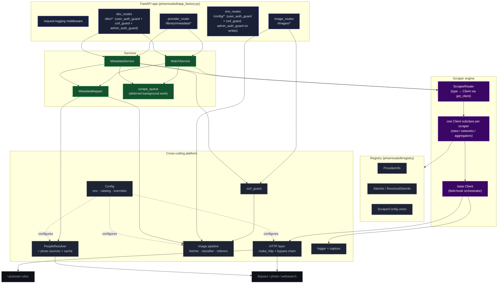

# Components (C4 Level 2)

## Key Relationships

- **Routes are thin.** `provider_router` (`phoenixadult/routes/provider_router.py`) delegates immediately to `MatchService` / `MetadataService`.
- **`ScraperRouter`** (`phoenixadult/services/scraper_router.py`) is a dispatcher: it resolves a scraper `type` to its single `Client` instance via `get_client` (`phoenixadult/clients/__init__.py`, `CLIENT_REGISTRY`). It owns `search`, `fetch_scene_detail`, and `decode`.
- **`MetadataMapper`** (`phoenixadult/mappers/metadata_mapper.py`) translates the scraper's `SceneDetail` into Plex's schema and rewrites every image URL through the `/images/proxy` endpoint.
- **Registry** is static data: providers, sites, and per-site `ScraperConfig` that selects and parameterizes a client.
- **`scrape_queue`** (`phoenixadult/services/scrape_queue.py`) runs background jobs on two lanes (dedup by key, 10,000-job cap): unpaced sites take five workers, sites behind a `ScenePacer` take exactly one, so a pacer's gate can never occupy every slot. When pacing or the serve budget defers a search/update (see [Concurrency](./concurrency.md)), the services enqueue it here to finish off the request path.
- **`FAST_GATE`** (`phoenixadult/utils/http/rate_limit_helper.py`) caps unpaced scene scrapes at five concurrent slots shared across all unpaced sites, inline and background alike (re-entrant per task, so a client that delegates to another client reuses its slot). An inline refresh waits up to the 10s sync budget for a slot, then raises `PacingDeferredError` and lands in the visible queue — so every unpaced backlog shows on `/queue`, which also renders the gate's busy/waiting counts. Searches on unpaced sites stay inline and ungated.
