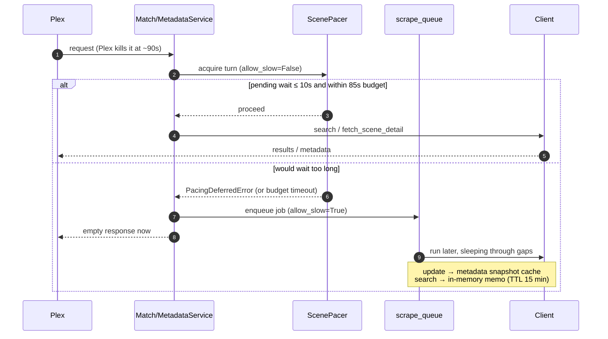

# Concurrency

## Serve Budget and Deferred Work

Plex aborts provider requests at ~90s, so both services cap serving at `PLEX_REQUEST_BUDGET` (85s):

- **Metadata** (`MetadataService.get_metadata`) wraps the coalesced scrape in `wait_for(shield(...))`. On timeout the scrape *continues* and lands in the snapshot cache.
- **Match** (`MatchService.match`) cancels outright.

**Deferral.** A foreground request that would wait more than 10s raises `PacingDeferredError` — from a `ScenePacer` on paced sites, or from the shared five-slot `FAST_GATE` on unpaced ones. The work is re-run through `scrape_queue` with `allow_slow=True`, which may sleep through the shared gap or wait for a free slot.

**Search store.** On paced sites a finished background search persists to the search store (`phoenixadult/utils/cache/search_store.py`, in `phoenixadult.db`), so a later Plex scan matches without re-searching. Keys are case- and whitespace-normalized, lifetime is `SEARCH_STORE_TTL_DAYS` (perpetual by default), and the in-memory memo fronts the store.

**Queue page.** The queue and pacer state are visible at `/queue`. It holds a long poll (`GET /queue/api/state?wait=1&since=<revision>`) open against a revision counter bumped on every enqueue, start, finish, flush, pause and resume, so entries appear and clear the moment a worker moves, with no fixed polling interval.

## Thread Pools

Every route is `async def`, so anything synchronous runs on the event loop unless handed to a thread. `asyncio.to_thread` hands work to the **one** default executor (`min(32, cpu+4)`) that every caller shares. A scrape probing 60+ artwork URLs, each ending in a Pillow decode, could fill it and leave a `/people` or `/metadata` page's SQLite read queued behind image work.

`phoenixadult/utils/concurrency/pools.py` replaces that single pool with named, bounded ones. `run_in(name, fn, …)` is a drop-in for `to_thread` against a chosen pool, and copies contextvars the same way, so request-id logging survives.

| Pool | Size | Carries |
|---|---|---|
| `store` | `max(8, min(32, cpu+4))` | SQLite reads and writes — cache pages, editors, search store, serve-path snapshot reads |
| `image` | `min(8, cpu/2)` | Pillow decode and dimension probing, face cropping |
| `fs` | 4 | File work — snapshot bundle writes, people and logo cache maintenance, manual NFO lookups, config saves, Plex import staging, the startup partial-write sweep |
| `auth` | 4 | Session and API-key lookups, kept off `store` so a reporting query cannot delay sign-in |
| `queue` | 1 | Scrape-queue replay rows; one worker keeps each key's add and remove in order |
| `search` | 2 | Metasearch (ddgs) web lookups, which block for seconds on their own network calls |
| `cpu` | `min(4, cpu/2)` | Proof-of-work captcha solving |

Pools are created on first use and shut down in the lifespan's `finally`. The `store` bound doubles as a cap on SQLite connections: connections are per-thread, so the pool size caps how many it holds.

### Rules

- **The default executor is for DNS.** Every outbound connection resolves its host there (`getaddrinfo`), so a slow job parked in it would delay every scraper and image fetch. Nothing at request time uses it, and `tests/framework/test_default_executor.py` keeps `asyncio.to_thread` out of the package.
- **SQLite belongs on a pool, never the loop.** `db.connect()` sets `busy_timeout=5000`, so a call issued from the event loop while a pool thread holds the write lock can stall every request for up to five seconds. `tests/framework/test_no_sqlite_on_loop.py` flags any store call made directly from async code.
- **One pooled task per handler.** A handler that needs several queries runs them inside one pooled task rather than gathering several: `/metadata` and its listing API each take a single `store` worker, not four.
- **Batches hoist their database work.** Where a batch enqueues work that must stay on the loop (the scrape queue touches loop state), the per-item database work runs as one pooled call ahead of the loop, and the loop yields between items.
- **Slow imports run off the loop.** `face_crop.available()` imports OpenCV and numpy on first use, so pages ask it on the `image` pool, and startup warms it in the background when face cropping is enabled.

## Fan-Out Gates

Fan-out limits are **process-wide, not per scene** (`utils/concurrency/gate.py`). A semaphore built inside the coroutine that uses it caps only one scene, so N queue workers would each open their own and the real ceiling would be N × the limit.

- **Shared gates.** Artwork probing, the two Data18 image probes and the snapshot image fetch take their gate from `loop_gate(name, limit)`, keyed per event loop so tests stay isolated. Artwork probing is additionally capped at `_PROBE_CONCURRENCY` (8) per scene, so one scene's images arrive as a stream rather than a burst.
- **No throughput cost.** The decode behind each probe runs on the `image` pool, so concurrency past that pool's width only lengthens its queue. It is also what keeps an interactive face-crop from queueing behind a bulk refresh, since `cache_photo` shares that pool.
- **A limit of one.** Score Group's `/search-es` accepts a single POST at a time and resets every other in-flight HTTP/2 stream with `INTERNAL_ERROR` — measured at 1/2, 1/3 and 1/5 successes concurrently against 6/6 serial. Its scene GETs are unaffected, so the chain looks healthy while search silently fails.
- **Retry on drop.** The Impersonate backend retries once on a dropped connection (stream reset, `Recv`/`Send failure`), which covers the residual. A failure that is not transient, like an unresolvable host, is not retried.

## What the Startup Banner Shows

The banner prints the pool sizes, queue lanes, fan-out caps and the bypass chain with its FlareSolverr endpoint — what you need when the UI goes slow or a backend quietly stops answering. A FlareSolverr transport failure names the endpoint it could not reach, so a wrong `FLARESOLVERR_URL` (unset, misspelled, or a stale address) shows in the log line rather than only in the config.

## Browser Connections

Browsers open at most six HTTP/1.1 connections per host, so the UI must not hold them all. The People page loads upstream originals through the image proxy **two at a time**, queued as they scroll into view, with a 20s give-up per slot. A screenful of slow upstreams therefore never blocks navigation or API calls from the same browser.
