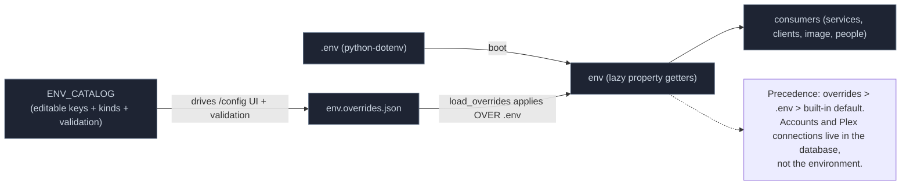

# Configuration Model

- Single source of env reads: `phoenixadult/config/env.py` — an `_Env` instance with lazy `@property` getters so a runtime override (or a test mutating `os.environ`) is reflected immediately.
- `phoenixadult/config/__init__.py` bootstraps the process: `load_dotenv()` then `load_overrides()`, and exposes the immutable startup `config` snapshot (`port`, `base_url`, `log_level`). Base URL env var is `PHOENIX_BASE_URL` (default `http://localhost:3000`).
- `phoenixadult/config/env_catalog.py` (`ENV_CATALOG`, `EnvVarSpec`, `normalize_env_value`) is the authority for what the config UI may edit and how values validate/normalize.
- `phoenixadult/config/env_overrides.py` (`set_override` / `clear_override` / `load_overrides`, file `env.overrides.json`) persists UI edits and re-applies them on boot — **this is the #1 debugging gotcha** (a stale override silently shadows `.env`).
