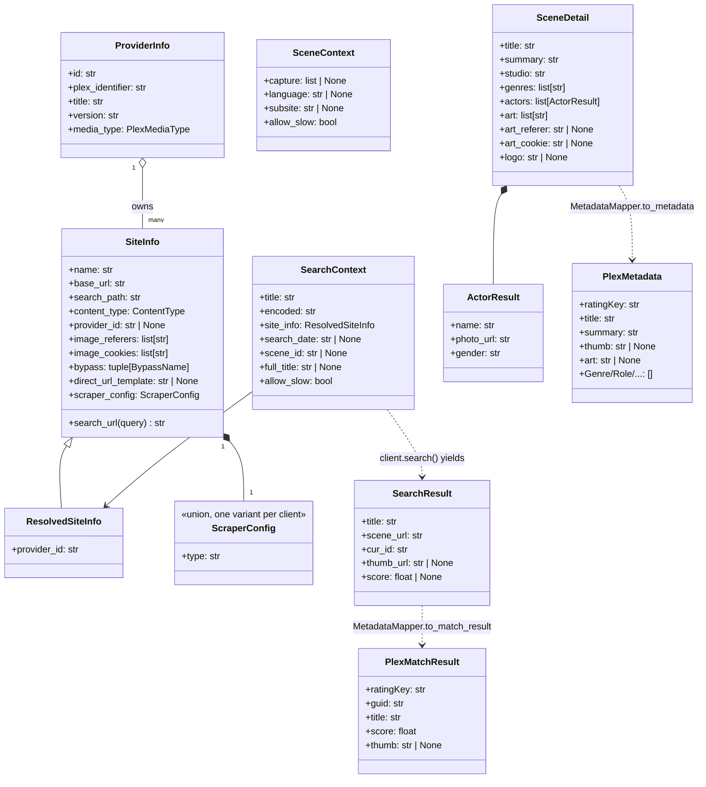
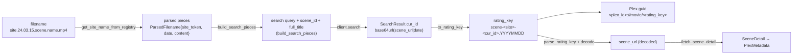

# Domain and Data Model

## Identifier Lifecycle (the Spine of the System)

The same scene is represented differently at each stage; the encoding is reversible so a Plex `ratingKey` round-trips back to a fetchable scene URL.

- Encode/decode: `Client.encode` / `Client.decode` = base64url, backed by `b64url_encode` / `b64url_decode` (`phoenixadult/utils/helpers/ids.py`); `cur_id` is assembled by `pack_cur_id`.
- `to_rating_key` / `parse_rating_key`: `phoenixadult/mappers/metadata_mapper.py` (regex `^scene-([a-z0-9]+)-([A-Za-z0-9_-]+)(?:\.(\d{8}))?$`).
- **Security-relevant:** the decoded `scene_url` is attacker-influenceable and is validated by `ensure_fetchable_url` (`phoenixadult/utils/http/ssrf_guard.py`) before any fetch (see [Security](./security.md)).

## Persistent State (phoenixadult.db)

Mutable state lives in one SQLite database opened by `phoenixadult/utils/db` (WAL, foreign keys enforced, `PRAGMA user_version` schema versioning):

- queue replays;
- the search store;
- the fully normalized scene snapshot store — scalars on `scenes`, dimension and junction tables for genres, collections, countries and people, image metadata in `scene_images`, image bytes on disk;
- the derived people-image and logo indexes, and the face-crop log.

Schema, normalization rationale, scoped-people resolution and backup guidance (`VACUUM INTO`) are in [database.md](../database.md).

Two small JSON sidecars sit beside the database rather than in it, both rebuildable and safe to delete: `logo-wells.json` (each logo's preferred backdrop) and `logo-templates.json` (the per-studio logo URL template).

### Text Rules on Serve

`refresh_cached_snapshot` re-applies text rules to every snapshot it serves. That is how a rule change reaches cached scenes without a re-scrape.

One rule is site-scoped: a `scoregroup` snapshot whose summary opens with a repeat of its own title sheds it. It is keyed on `scraper_type` the same way `_EPISODE_TAGGED` is, because the Score Group template used to fold the description heading into the summary. The comparison is case-insensitive and also tries the title up to a ` - `, so a series entry named by its cast still matches.

### Genre Normalization

`normalize_genres` (`phoenixadult/utils/genres/`) applies `genres.json`'s skip and alias rules, then drops any remaining free-form tag that matches one of the scene's own actor names — sites routinely tag a scene with its cast.

- The filter runs *after* the alias lookup, so a value `genres.json` recognizes is never dropped: a performer named "Latina" cannot remove the *genre* Latina.
- It runs in `MetadataMapper` for fresh scrapes, matching both the scraped and the aliased spelling of each name, and in the cache's `reapply_text_rules`, so an existing snapshot is cleaned on its next refresh. No individual client has to implement it.

### Duplicate Snapshots

Redundant snapshots are surfaced by two passes in `phoenixadult/utils/cache/duplicates.py`:

- **Stale pass.** Keys on the rating key, so a subsite-qualified `cur_id` supersedes the bare one.
- **Content pass.** Groups snapshots that share a normalized title, release date, studio and tagline **and** the site's own scene id. The id is parsed from `source_url` by `scene_url_id`: an `id=` query parameter, else a trailing all-digit path segment, else empty. One scene published under two slugs therefore still groups, while two entries of a recurring series that reuses its title (Score Group's `Funbag Fuckers`) do not.

Purging drops every rating-key-superseded entry, plus all but the newest member of each content group.

### Missing Images

A third pass, `integrity.missing_image_entries()`, lists scenes whose `thumb` or `art` cannot render — the state that draws a broken thumbnail rather than the "No Image" placeholder. Two things qualify:

- a `/cache/…` path whose file is gone;
- a URL the scrape never localized at all (an `/images/proxy?url=…` left behind by a failed download) — the commoner case.

An empty field is not broken; it is what produces the placeholder.

The pass backs the **Show Missing Images** filter on `/metadata`. It composes with the duplicate filters by intersection, so **Refresh Filtered** re-scrapes exactly the affected snapshots. It costs one stat per snapshot path, resolves the cache root once per scan, and is memoized on the same change token as the duplicate scans.
