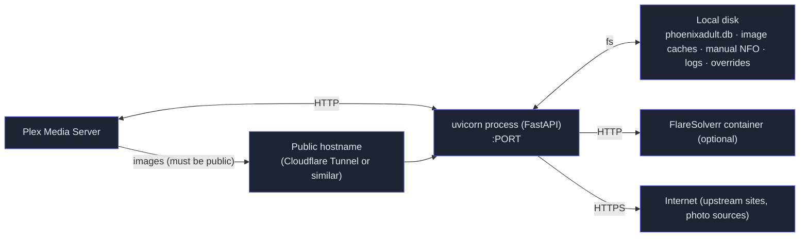

# Deployment

## Process Model

- **One process.** A single uvicorn process serves everything. Its state is `phoenixadult.db`, the on-disk image caches and `env.overrides.json`.
- **Running it.** `python -m phoenixadult.main` calls `uvicorn.run`, and auto-reloads outside production.
- **Supervised restart.** `POST /config/api/restart` sends `SIGTERM` to its own PID and relies on a process supervisor to relaunch it.
- **FlareSolverr** is an optional sidecar.

## Ways to Run It

| Option | What it provides | Where it's documented |
|---|---|---|
| FreeBSD port (`www/phoenixadult`) | Package, rc.d service with optional VPN connect + watchdog and a Cloudflare tunnel | [Hosting](../hosting.md#freebsd-port) |
| Docker Compose | The app image plus a FlareSolverr sidecar; the image answers a `/health` check | [Hosting](../hosting.md#docker) |
| systemd (Debian/Ubuntu) | A hardened unit + virtualenv installer under `packaging/systemd/` | `packaging/systemd/README.md` |
| Windows | `scripts/start-with-tunnel.ps1`: a quick tunnel plus the app in one command | [Hosting](../hosting.md#windows) |

## Image Reachability

Plex fetches two kinds of images from the provider on demand rather than keeping them: cast photos (`Role.thumb`) and the clearLogos pushed to collections. Both are built on `IMAGE_BASE_URL`.

From Plex Media Server **1.43.5**, the photo transcoder refuses caller-supplied URLs on private addresses ("not a permitted destination for a caller-supplied URL"). Plex staff confirmed this is intended: images used by providers must be publicly accessible URLs. Support for local actor-thumbnail assets is tracked internally but not scheduled.

Consequences:

- **`IMAGE_BASE_URL` must resolve to a public address.** A LAN IP or `.local` host now shows grey circles for every cast photo Plex hasn't already cached.
- **The host must be stable.** Plex stores the URL, so a quick-tunnel hostname that changes on restart breaks every photo fetched under the old one. Use a named tunnel or another fixed hostname.
- **Expose only what's needed.** The public hostname only has to serve `/images/` and `/cache/`. A Cloudflare Tunnel ingress rule can limit it to those paths, and the image guard plus signed URLs still apply on top (see [Security](./security.md)).

## Continuous Integration and Docs

The repository lives on Codeberg and is mirrored to GitHub; both run CI:

| Workflow | Runs | Does |
|---|---|---|
| `.forgejo/workflows/ci.yml` / `.github/workflows/ci.yml` | pushes and PRs touching code, tests, scripts or their inputs; GitHub also weekly | the commit gate (see [Conventions](./conventions.md#commit-gate)) |
| `.forgejo/workflows/pages.yml` | pushes to `main` touching `website/` or `docs/` | typechecks, builds and publishes the docs to Codeberg Pages |
| `.github/workflows/pages.yml` | the same pushes, plus PRs | typechecks and builds; deploys to GitHub Pages on `main` only |
| `.github/workflows/docker.yml` | Dockerfile, compose or `pyproject.toml` changes, and weekly | validates the compose file, builds the image and waits for `/health` |

Dependabot (`.github/dependabot.yml`) checks pip, npm, Docker, docker-compose and GitHub Actions weekly. Python lower bounds are only raised when a release falls outside them, so the FreeBSD port's minimums don't churn.
