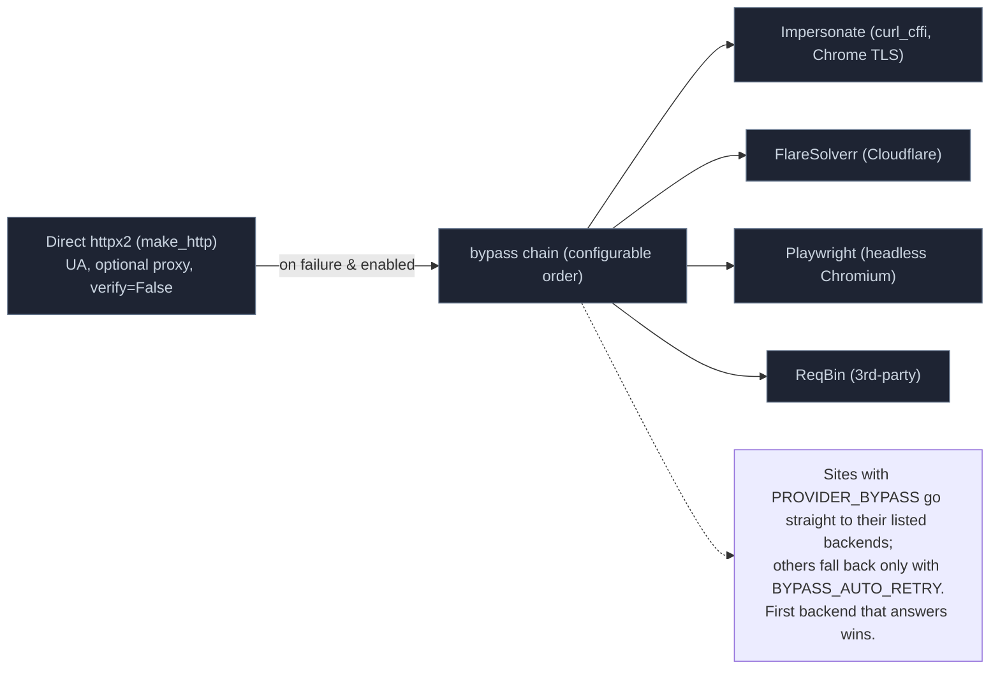

# HTTP and Anti-Bot Bypass



## Direct Requests

`make_http` (`phoenixadult/utils/http/client.py`) builds a shared `httpx2.AsyncClient`:

- a fixed User-Agent and an optional proxy that honors `NO_PROXY`;
- TLS verification intentionally relaxed (`verify=False`) for unreliable CDNs — the SSRF guard is the mitigation (see [Security](./security.md#known-residuals));
- every redirect re-checked by the SSRF guard (`_guard_redirect`).

## Network-Down Fast Fail

When the network drops (a VPN going down is the usual cause), DNS stops answering, and every lookup would otherwise wait out the full resolver timeout. `phoenixadult/utils/http/connectivity.py` turns that into an immediate failure:

1. A failed lookup or connect to a public host runs the shared probe: TCP to 1.1.1.1/8.8.8.8 plus a DNS lookup, single-flight, cached 15s.
2. While the probe reports down, `ssrf_guard` lookups, `make_http` requests to public hosts and the image proxy fail at once instead of queueing behind the dead resolver.
3. LAN hosts (`.local`, private IPs) still go out, so FlareSolverr and Plex servers keep working.
4. The next probe after the 15s cache expires detects recovery.

Lookups are capped at 5s even when the network is up. Every admin page shows a top-bar banner while the network is down (see [Web UI](./web-ui.md#navigation)).

## Bypass Chain

`phoenixadult/utils/http/bypass.py` (`bypass_get` / `bypass_post` / `http_bypass`) orders backends by `BYPASS_ORDER`, skips unavailable ones (each exposes `is_available()`), and returns the first 2xx that isn't itself a challenge page. It returns `None` when no backend is available or all fail.

| Backend | Module | Notes |
|---|---|---|
| **Impersonate** | `impersonate.py` | `curl_cffi` mimicking a real Chrome TLS/JA3 fingerprint. The only backend that defeats fingerprint-based Cloudflare blocks *and* forwards custom headers (e.g. `Referer`), so it leads the chain. Optional: `pip install -e ".[impersonate]"`. |
| **FlareSolverr** | `flaresolverr.py` | Solves Cloudflare interstitials via a sidecar container. Drops custom request headers. |
| **Playwright** | `playwright.py` | Headless Chromium; forwards headers via the browser context. Optional: `pip install -e ".[playwright]"`. |
| **ReqBin** | `reqbin.py` | A third-party fetch relay. |

The default order is **Impersonate → FlareSolverr → Playwright → ReqBin**.

**Challenge detection.** A 2xx whose body still contains a challenge marker (AWS WAF, `just a moment`, `cf-chl-`, Turnstile) counts as unsolved, so the chain moves to the next backend.

## Sites That Require a Bypass

A site that blocks plain requests declares it in its selector file, not in its client:

```python
PROVIDER_BYPASS: list[BypassName] = ['Impersonate', 'FlareSolverr']
```

`Provider.from_headers` applies it to every site in the file. The registry turns those declarations into a host map (`registry.bypass_for_url`) and registers it with the bypass module, so `utils/` code can ask for it without importing the registry:

- **Every request to that host is covered.** `fetch_and_load`, `fetch_json`, GraphQL calls and direct `bypass_get`/`bypass_post` all look the URL's host up, so a site's pages, its API and other clients' lookups (Black PayBack asking IAFD) follow the same entry. Requests to unflagged hosts — Data18 enrichment during a Score Group scrape, for example — stay plain.
- **Straight to the bypass.** A required host skips the plain request, which would only fail or draw a challenge.
- **Only the listed backends, in order.** The site's list replaces `BYPASS_ORDER` for that host, so a backend that cannot help (FlareSolverr drops the custom headers an API needs) is never tried.
- **One list per host.** Two sites on the same host must declare the same list; the registry refuses to load otherwise.
- **Visible in the site list.** `docs/sitelist.md` shows `| Impersonate Required` (or `X and Y Required`, `X, Y and Z Required`) after the search-method icon.

Current declarations:

| Site(s) | `PROVIDER_BYPASS` | Why |
|---|---|---|
| The Score Group | `['Impersonate', 'FlareSolverr']` | Plain requests are fingerprint-blocked; Impersonate serves most pages and FlareSolverr clears the challenges it hits |
| IAFD | `['Impersonate']` | Plain requests get 403 from the server's network |
| Bellesa | `['Impersonate']` | The API returns 403 and a challenge; FlareSolverr would drop its JSON headers |
| Strike3 | `['Impersonate']` | Ported with Impersonate for its Cloudflare-fingerprinted GraphQL |

Everything else uses plain requests. With `BYPASS_AUTO_RETRY` on, a failed plain request (4xx/5xx or a challenge page) retries through the global `BYPASS_ORDER`.

IAFD-backed people lookups (gender detection and the IAFD photo source) therefore need `curl_cffi` installed. Without it they degrade to empty results rather than erroring.

## Ban-Avoidance Pacing

`ScenePacer` (`phoenixadult/utils/http/rate_limit_helper.py`) protects ban-prone sites. Scrapers such as `nubiles.py` and `naughtyamerica.py` set `Client.pacer`, and the base orchestrators route every search and scene scrape through it:

- **One gap track.** Searches and scenes share it: after any turn the next waits `SCENE_GAP` (default 10s) plus a random 10–45s jitter.
- **Hard cap.** At most 8 scenes per 10 minutes, with jittered per-request spacing inside a scrape.
- **Deferral.** A foreground (Plex-facing) request that would wait more than 10s raises `PacingDeferredError` and finishes through `scrape_queue` instead (see [Concurrency](./concurrency.md#serve-budget-and-deferred-work)).
