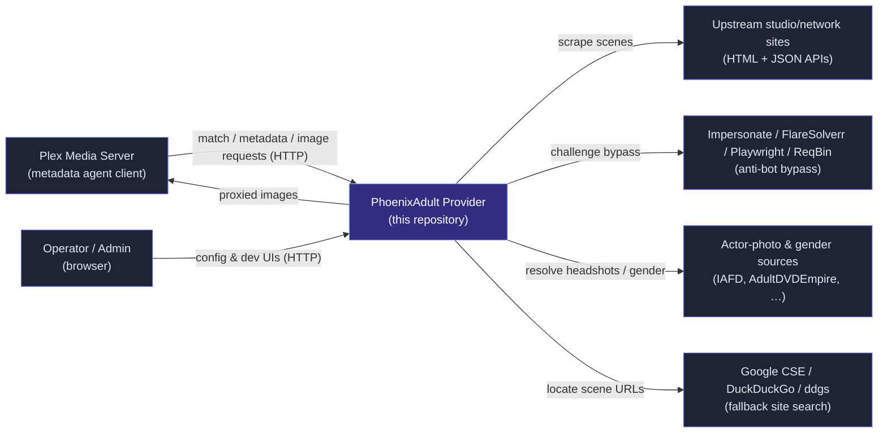

# Design Overview

**Status:** living document · **Audience:** maintainers and contributors
**Scope:** the Python/FastAPI Plex metadata provider in this repository, built on Plex's Metadata Provider API.

These pages are *model-based*: each one leads with a diagram (UML-style, rendered with Mermaid), and the prose explains only what the diagram cannot. Diagrams are grounded in the current source, with file references so a model can be checked against the code. Update a diagram alongside the code it models — a stale model is worse than none.

## Purpose

PhoenixAdult is an HTTP service that implements the **Plex Metadata Provider** contract for adult video libraries:

1. Plex sends it a filename to *match*.
2. Plex then asks for *metadata* and *images* for the chosen result.
3. The service scrapes hundreds of studio and network sites, normalizes the data into Plex's schema, resolves actor headshots from external sources, and serves images back to Plex.

| Dimension | Value (current) |
|---|---|
| Providers | 1 (`phoenixadult`) |
| `Client` subclasses | one per scraper, discovered into `CLIENT_REGISTRY` |
| Site and network definitions | one group per scraper type, spanning ~1,200 individual sites |
| Actor-photo sources | 8 (IAFD, AdultDVDEmpire, Indexxx, Babepedia, …) |
| HTTP-bypass backends | 4 (Impersonate, FlareSolverr, Playwright, ReqBin) |
| Runtime | Python 3.13+, FastAPI, uvicorn, httpx2 (async), parsel (XPath / lxml), Pillow |

## System Context (C4 Level 1)

**Trust note:** Plex and the upstream sites are *not* trusted inputs. Plex-supplied ratingKeys and filenames, and all scraped content, cross a trust boundary (see [Security](./security.md)).

## Pages

| Page | Covers |
|---|---|
| [Use Cases](./use-cases.md) | Every entry point and how it is authenticated |
| [Web UI](./web-ui.md) | Page shell, navigation, theme kit, components, localization |
| [Components](./components.md) | Containers and components (C4 Level 2) |
| [Data Model](./data-model.md) | Domain classes, the identifier lifecycle, persistent state |
| [Scrapers](./scrapers.md) | The client hierarchy and its field-hook orchestrators |
| [Request Flows](./request-flows.md) | Match, metadata, bypass, image proxy and config sequences |
| [Concurrency](./concurrency.md) | The Plex serve budget, deferred work and thread pools |
| [HTTP and Bypass](./http-bypass.md) | Outbound HTTP, the network-down fast fail, anti-bot backends, pacing |
| [People](./people.md) | Actor, director and producer resolution |
| [Security](./security.md) | Trust boundaries, controls and known residuals |
| [Configuration Model](./configuration-model.md) | How `.env`, overrides and the catalog combine |
| [Deployment](./deployment.md) | Process model, hosting options and image reachability |
| [Conventions](./conventions.md) | Patterns, coding conventions and the commit gate |
| [Directory Map](./directory-map.md) | Where things live in the repository |
| [Title-Case Parser](./title-case.md) | The `title_case()` engine (appendix) |
