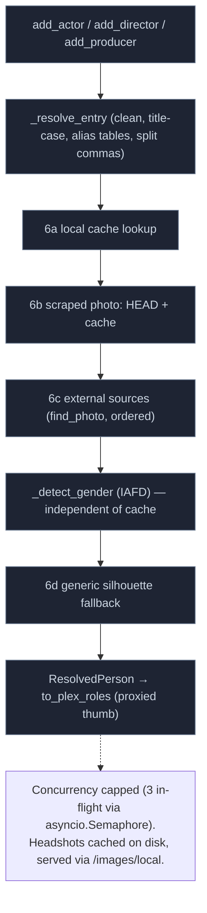

# People (Actor) Resolution

`PeopleResolver.resolve_all` (`phoenixadult/utils/people/__init__.py`) drives the cascade for each person:

1. Clean the name and title-case it (`title_case(..., type='name')`).
2. Drop skip-names.
3. Apply the per-studio, then the global alias tables (`ACTORS_REPLACE` / `ACTORS_REPLACE_STUDIOS` in `phoenixadult/utils/people/data.py`).
4. Resolve a headshot, in order: local cache, the scraped photo, external sources, then a generic silhouette.

## Photo Sources

External sources live under `phoenixadult/utils/people/sources/` and are fanned out by `find_photo`. There are eight site-specific XPath sources: `iafd`, `adult_dvd_empire`, `babepedia`, `babes_and_stars`, `boobpedia`, `indexxx`, `jav_database`, `local_storage`. Retired sources (Freeones, JAVBus) wait in `phoenixadult/graveyard/`.

IAFD needs a bypass backend (see [HTTP and Bypass](./http-bypass.md#sites-that-require-a-bypass)).

## Gender

Gender detection (`iafd_gender_check`, `phoenixadult/utils/people/gender.py`) is decoupled from the cache, so `GENDER_DETECT_ENABLE` works regardless of `PEOPLE_CACHE_ENABLE`. `GENDER_SKIP_MALE_ENABLE` drops male actors.

## The Headshot Cache

- **Storage.** Headshots are cached on disk under `PEOPLE_CACHE_DIR` and served via `/images/local/...` with signed URLs.
- **Atomic writes.** Every photo (and its uncropped original) is written to a hidden `.part` file beside its final name, then renamed into place, so an interrupted write never leaves a truncated photo. A background sweep at startup removes `.part` files more than an hour old.
- **Face cropping.** With `PEOPLE_CACHE_FACE_ENABLE`, photos are cropped to the face on the `image` pool (see [Concurrency](./concurrency.md#thread-pools)).

## Plex Must Reach the Photos

Plex fetches cast photos itself, on demand, from the `thumb` URL in each role. From Plex Media Server 1.43.5 it refuses provider image URLs on private addresses ("not a permitted destination for a caller-supplied URL"), and Plex staff confirmed provider images must be publicly reachable. `IMAGE_BASE_URL` must therefore resolve to a public address — see [Deployment](./deployment.md#image-reachability).
