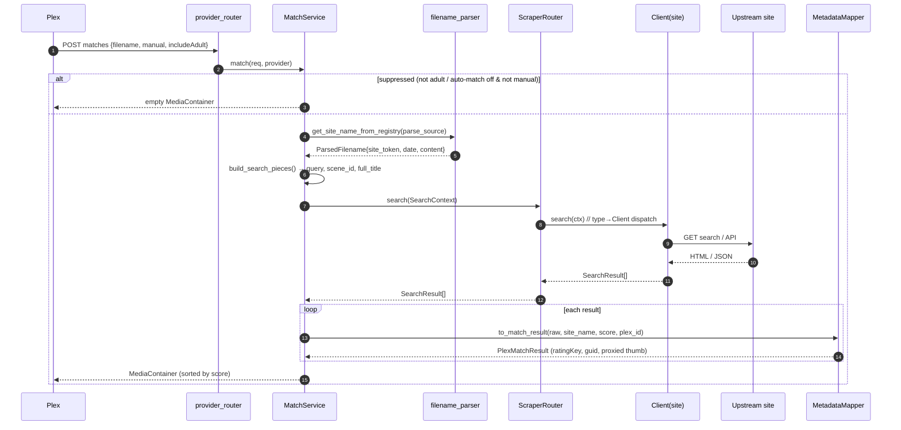
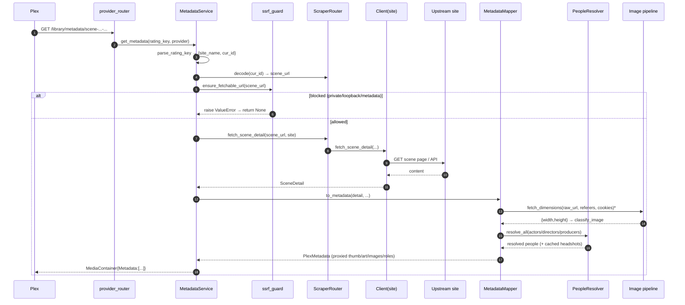
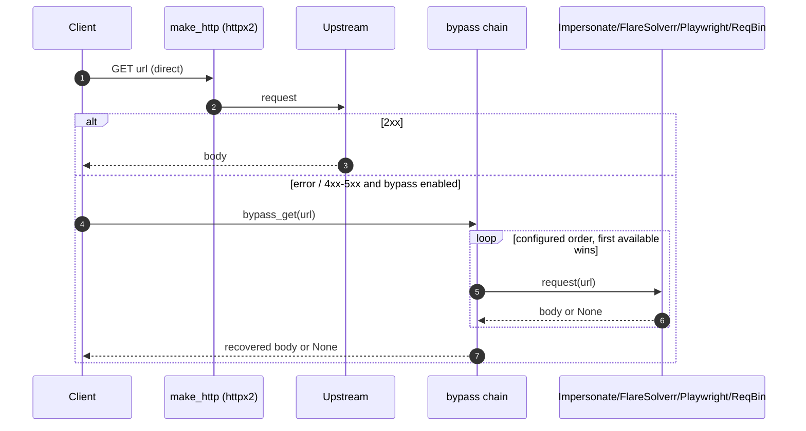
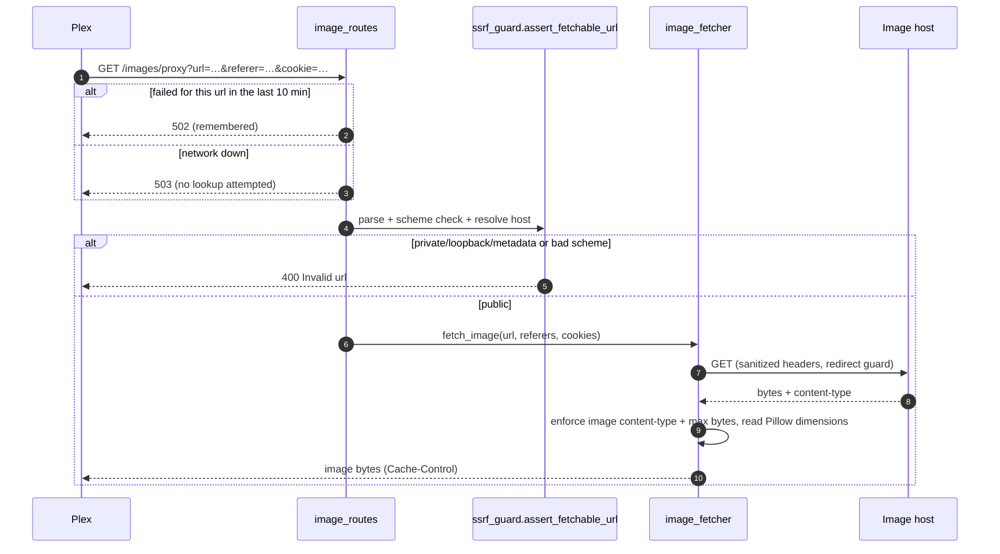
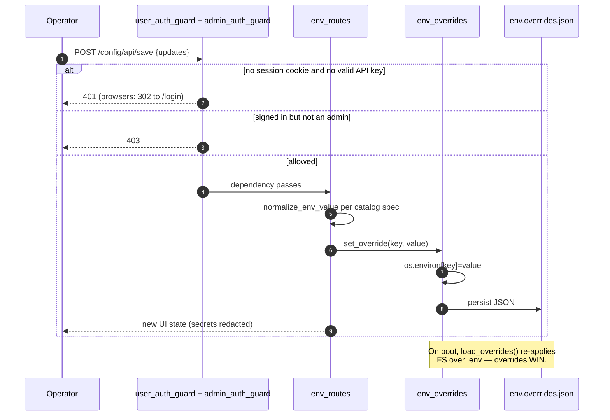

# Request Flows

## Match — `POST /library/metadata/matches`

## Metadata — `GET /library/metadata/{rating_key}`

## Provider Status Codes

Both features answer with the four codes Plex defines for metadata providers:

| Code | Match | Metadata |
|------|-------|----------|
| 200 | Results, or an empty MediaContainer (suppressed request, no registry site in the filename, no perfect auto match, site down while the internet is up) | Scraped or cached scene |
| 400 | No title/filename to parse | Malformed ratingKey: bad format, missing parts, unknown site, undecodable curID |
| 404 | Never | Valid ratingKey whose scene yields nothing while online |
| 500 | Pacing deferral, Plex-budget timeout, no network connectivity, unexpected exception | Same |

- **Error types.** Requests that can never succeed raise `MalformedRequestError`; transient failures raise `ProviderUnavailableError` (`services/provider_errors.py`). The router maps them to 400 and 500.
- **Site down or offline?** Connectivity is judged only when a scrape came up empty *and* the shared HTTP transport recorded a transport-level failure (DNS or connect). The shared connectivity probe — TCP to 1.1.1.1/8.8.8.8 plus a DNS lookup, cached 15s — then decides between "site down" (200/404) and "offline" (500). See [HTTP and Bypass](./http-bypass.md#network-down-fast-fail).
- **Tracing.** At `LOG_LEVEL=verbose` every match and metadata request is dumped with full headers and JSON body.

## Scraper Fetch with Anti-Bot Bypass Fallback

## Image Proxy — `GET /images/proxy?url=…`

- **Remembered failures.** A failed upstream fetch is remembered for ten minutes per URL, referer and cookie set, and answered 502 at once. Failures while the network is down are not remembered, so images return as soon as the connection does.
- **Network down.** The proxy answers 503 before resolving anything (see [HTTP and Bypass](./http-bypass.md#network-down-fast-fail)), so a page full of images cannot queue behind a dead resolver.
- **Pinned fetch.** With `IMAGE_PROXY_PIN` (on by default) the fetch connects to the IP the guard validated, closing the DNS-rebinding gap for this route.
- **Classified variant.** `/images/proxy-classified` is the same flow plus a `classify_image(width, height)` step. It returns 404 when the image classifies as `unknown` and stamps `X-Image-Type` on success.

## Runtime Config Override

