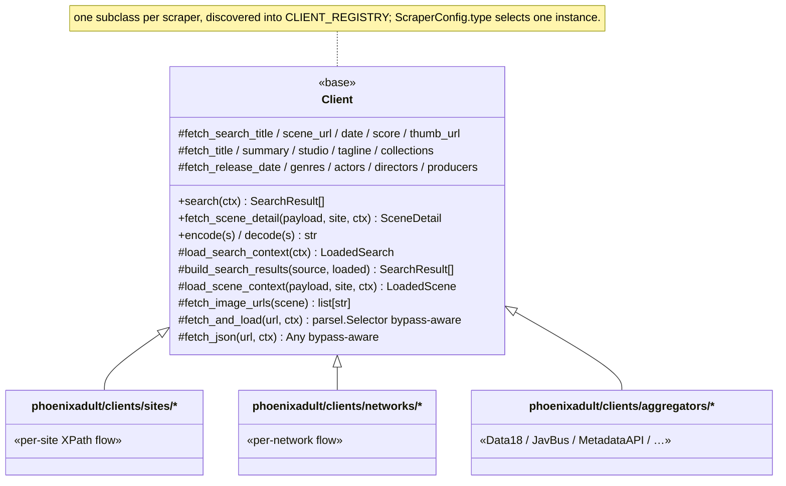

# Scraper Client Hierarchy (Template Method / Field Hooks)

The base `Client` (`phoenixadult/clients/base.py`) defines two *orchestrators*, `search()` and `fetch_scene_detail()`, that call a fixed sequence of overridable *hooks*. A concrete client implements only the hooks its site needs; the orchestration — dedup, parallel field fetch, capture logging, bypass fallback — lives once in the base.

**Every scraper is hand-written.** There is intentionally *no* shared, config-driven client (no `JsonClient`, no per-network base class). Shared *helpers* are fine: `GraphQLClient` (`phoenixadult/clients/_graphql.py`), `html_helpers`, and the image adapters.

Clients are discovered, not registered: `CLIENT_REGISTRY` is built by walking `phoenixadult/clients/`, keyed on the module basename unless the class sets `scraper_type`. Start a new one with `python scripts/new_scraper.py` (see the [Scraper Test Plan](../scraper-test-plan.md)).

## Search

The search default is `load_search_context` plus a per-source `build_search_results`, which:

- calls `fetch_search_scene_url` / `fetch_search_title` / `fetch_search_date` / `fetch_search_score` / `fetch_search_thumb_url`;
- dedups on `scene_url`;
- packs the `cur_id` through `search_cur_id`, which a client overrides when its rating key also folds in the searched date.

**Candidate-page mode.** A site with no results page opts in instead of setting `search_rows_xpath`. Setting `candidate_include` (and optionally `candidate_exclude`) makes `load_search_context` gather the client's own `candidate_urls` guesses plus the matching `web_search_urls` hits, fetch each page, and hand them to the same field hooks as `CandidatePage` sources. The title defaults to `title_xpath` and the URL to the page itself.

**Hand-written `search()`.** Clients whose search fits neither shape — rewritten queries, URL normalization, compound path filters, results pages that lead to detail pages — keep their own.

## Scene Detail

The detail default is `load_scene_context` plus one hook per field: `fetch_title` / `summary` / `studio` / `tagline` / `release_date` / `genres` / `actors` / `directors` / `producers` / `collections` / `image_urls`.

- **Concurrency.** `fetch_scene_detail()` fans the field hooks out with `asyncio.gather` (one network or parse step per field), then assembles a `SceneDetail`.
- **Shared label defaults.** `fetch_studio` sets the site's provider name, falling back to the site name, and the mapper serves `[tagline]` (else `[studio]`) as the collection. A client writes those hooks only when its value differs.
- **Cross-field rules.** Because the hooks run concurrently, a rule that needs one field to see another belongs in an `update()` override that runs after `super().update()`. That is where Score Group appends the cast to the titles it reuses across unrelated scenes (`_SERIES_TITLES`).

## Data18 Enrichment

Data18 picks its scene by scoring every search hit across every result page and keeping the best, ranked by:

1. highest accuracy;
2. smallest release-date gap;
3. the billed cast.

A title a studio reuses returns many same-provider hits that all clear the accuracy threshold, and two of them can share a release date — hence the cast tiebreak:

- The cast comes from the `Scene w/ …` / `Movie w/ …` line on the result row, compared on alphanumerics so `J.T.` and `Jt` are one name.
- Rows without that line rank on date alone, so a caller that passes no cast is unaffected.
- A candidate that scores the maximum on all three short-circuits the scan, keeping the common case at one page.

## Score Group

Score Group refreshes release dates to keep old scenes looking new, so it scores and dates itself against the grain of the shared helpers:

- **Scoring.** A candidate that is not an outright scene-id hit scores `0.7 × title + 0.3 × date`, not `build_search_result`'s date-only branch. `date_distance_score` is a Levenshtein distance between the date *strings*, so a twelve-year gap still scores 94 — nearly useless on its own.
- **Release date.** The stored date is the **earlier** of the filename date and the scraped one. `display_date` keeps the scene's own date either way.
- **Series titles.** Reused titles get the cast appended: `Funbag Fuckers - Shyla Stylez and J.T.` — comma-separated with a final `and`, males dropped when `GENDER_SKIP_MALE_ENABLE` is on at scrape time.
- **Search endpoint.** `fetch_and_load(form=…)` switches to a form-encoded POST for `/search-es`, bypass included. That endpoint accepts one request at a time (see [Concurrency](./concurrency.md#fan-out-gates)).

## Fetching and Tracing

- **Direct first.** `fetch_and_load` / `fetch_json` try a direct httpx2 request and fall back to the bypass chain when enabled (see [HTTP and Bypass](./http-bypass.md)).
- **One trace for everything.** Every response a client receives is dumped by `trace_response` (`utils/logging/response_trace.py`) to a file under `<LOG_DIR>/dumps/`, to the verbose log, and to the dev UI capture sink from one call, so the three cannot drift.
- **No silent drops.** A request that never returns a response says so at `warn`.
- **XPath only.** HTML is parsed with `parsel.Selector` (lxml-backed).

## XPath Cost

Parsing is cheap (~3 ms for a 170 KB page); XPath evaluation is not, and it runs **on the event loop**.

An unanchored `//div//span[...]` walks every div and then every descendant span of each. It measured 8–33 ms per page, against 0.2 ms for the `//span[...]` that selects the same nodes. Anchor a descendant scan on an id or class, or start it at the element you actually want: the cost lands on every request the process is serving, not just the scrape that paid for it.

## Artwork

- **Classification.** Images are classified by aspect ratio (`classify_image`): a portrait image with aspect ~1.4–1.6 is a `coverPoster`, a landscape image a `background`.
- **Probe, then choose.** `_probe_artwork` drops any URL whose dimensions cannot be read, and `_resolve_artwork` picks the poster and background from what *survived* that probe — never from the raw `detail.art` list. Falling back past the validation is how a URL the site 404s would reach a snapshot and render as a broken card.
- **All dead.** A scene whose every artwork URL is dead gets no poster at all, and says so at `info`.

## ClearLogos

Logos are managed separately from scenes; scenes never carry one.

- `phoenixadult/utils/images/logo_cache.py` stores `logos/<studio-slug>/logo.<name-slug>.<ext>` files, rasterizing SVGs via rsvg-convert, cairosvg or ImageMagick.
- They are reviewed at `/logos` (see [Web UI](./web-ui.md#logos-ui)).
- `plex_reconcile.push_collection_logos` (the "Push Logos to Collections" action) pushes them to Plex **collections**.
