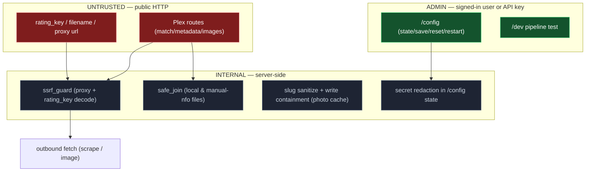

# Security Model (Trust Boundaries)

## Controls in Place

- **Admin auth** (`user_auth_guard`, `phoenixadult/utils/auth/user_auth.py`): wired as a router dependency on every admin router. Accepts a `pa_session` cookie (DB-backed, 30-day sliding expiry, HttpOnly + SameSite=Lax, `Secure` when the request arrives over https) **or** a per-user API key via `Authorization: Bearer` / `x-api-key`. Failure raises `LoginRequired`, which the app handler turns into a 302 to `/login?next=…` for browser navigations and a JSON 401 for everything else. There is no loopback bypass and no blank-token open mode.
- **Password policy** (`password_error`, `phoenixadult/utils/auth/passwords.py`): 8+ characters with an uppercase letter, a number, and a special character, enforced at every entry point (setup, account change, the Users tab, `scripts/reset_password.py`) with the same message mirrored client-side. An advisory zxcvbn strength meter (`password_strength`, served at `POST /api/password-strength`) scores as you type but never blocks.
- **Credentials at rest**: passwords hash with **argon2id** (`argon2-cffi`); session tokens are high-entropy random values stored as SHA-256 digests. API keys are looked up by SHA-256 digest too, and also kept encrypted so `/account` can show the owner their key. The other reversible secret is the Plex token, which must be replayed to Plex and is never returned by any API. Both are encrypted with Fernet using a key derived from `secret.key` (generated beside the database, never in the DB or environment).
- **Brute force**: `/login` and `/setup` are throttled per IP+username — five free attempts, then exponential backoff to five minutes (`phoenixadult/utils/auth/rate_limit.py`), returning 429 with `Retry-After`.
- **CSRF**: the session cookie is `SameSite=Lax`; unsafe methods additionally require a same-origin `Sec-Fetch-Site` and a matching `Origin` host. API-key callers are exempt (a header credential cannot be replayed cross-site).
- **Framing and sniffing**: every response carries `X-Frame-Options: DENY`, `Content-Security-Policy: frame-ancestors 'none'` and `X-Content-Type-Options: nosniff` (`phoenixadult/utils/http/security_headers.py`), so no page can be embedded for clickjacking.
- **Login redirect**: `next=` is honored only as a same-site path — not `//host`, and no backslash, which browsers read as `/`.
- **SSRF guard** (`phoenixadult/utils/http/ssrf_guard.py`): scheme allow-list + private/loopback/link-local/CGNAT/metadata (`169.254.169.254`) blocklist with hostname resolution; applied to the image proxy (`assert_fetchable_url`) and to the rating-key-decoded scene URL (`ensure_fetchable_url`).
- **Path safety**: `safe_join` (`phoenixadult/utils/fs/paths.py`, used by every file-serving route) anchors containment on the resolved root; photo-cache slugging strips separators/`..` with a write-containment backstop.
- **Secret hygiene**: `/config/api/state` redacts secret values (exposes only whether set); the request-logging middleware deliberately does not log `/config` bodies (they can carry secrets being saved).

## Known Residuals

Documented, not yet fixed:

- DNS-rebinding TOCTOU: the image proxy fetches by the validated, pinned IP (`IMAGE_PROXY_PIN`, on by default), but the rating-key scene-URL check and the redirect guard still resolve and then fetch.
- Scrape URLs are trusted as they come from the site table; only a rating-key-decoded scene URL is SSRF-checked up front. Redirects are checked on every client (`_guard_redirect`).
- The image guard admits loopback clients (Plex on the same host), so behind a same-host reverse proxy every image request looks local and passes it.
- No general inbound rate limit: `/login` and `/setup`, failed hook-key attempts and the provider's per-day quotas are throttled; other routes are not. No request-body size cap either (every such route requires sign-in; uploads are admin-only).
- TLS verification is intentionally relaxed (`verify=False`) for upstream CDNs; the SSRF guard is the mitigation.

> The `title_case` ReDoS (O(n²) post-process passes on long scraped titles) is **mitigated** by a `MAX_TITLE_LENGTH` input cap — see [Title-Case Parser](./title-case.md).
