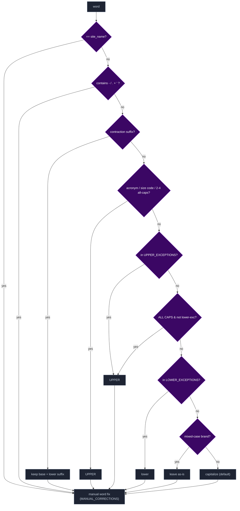
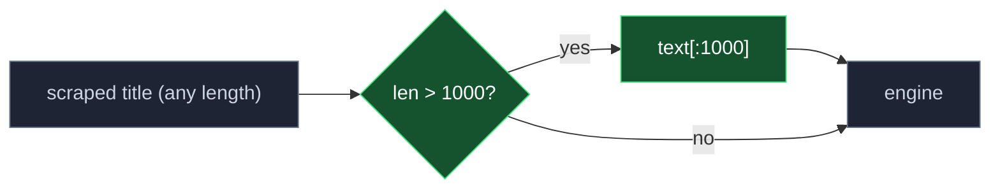
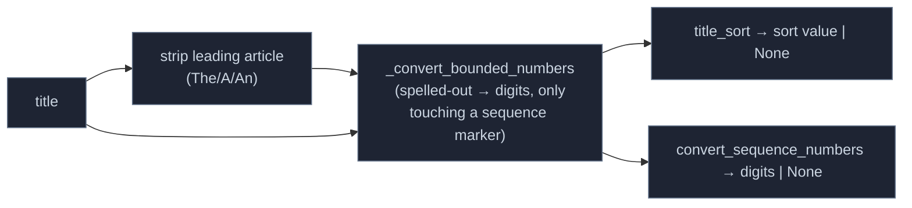

# Title-Case Parser Model

`title_case()` (`phoenixadult/utils/processors/title_case.py`) normalizes scraped titles and
actor names for Plex. It is a small pipeline: a stateless transform built from a
tokenizer, a per-word rule engine driven by lookup tables, and a post-process
regex stage. It is invoked by `MetadataMapper` (clean title + genre labels) and
`MatchService` (display title) and by `PeopleResolver` (actor names, `type='name'`),
so it runs on every result and every actor name.

## Pipeline

The post-process stage runs six named passes in order (`_post_process`):

1. `_normalize_quotes_and_articles` — straighten smart quotes; rotate a trailing `", The"`/`", A"`/`", An"` to the front.
2. `_fix_spacing` — space after sentence punctuation (domain suffixes exempt), strip stray spaces before punctuation, balance quote spacing.
3. `_capitalize_boundaries` — capitalize after sentence/bracket boundaries, before a spaced dash (segment-final, so `… Move In - Part Two` cases hold), and the final word.
4. `_normalize_initials` — collapse spaced initialisms (`J. J.` → `J.J.`), apply `collapse_initial_pairs`, normalize `vs.`.
5. `_fix_grammar` — `s's`→`s'` possessives, a/an agreement (with `u`-sound exceptions), honorifics get their period (skipped for `type='name'`).
6. `_finish_by_type` — titles get `normalize_sequence_separator` and `START_CONTRACTIONS`; then `expand_initial_pairs`, `W/`→`w/`, and per-scraper phrase corrections (`SCRAPER_PHRASE_CORRECTIONS`).

## Per-Word Decision Cascade (`normalize_word`)

## Rule Tables (Data That Drives Behavior)

| Table | Purpose | Examples |
|---|---|---|
| `LOWER_EXCEPTIONS` | small words kept lowercase mid-title | of, the, and, vs |
| `TLD_FRAGMENTS` | lowercased only as a domain suffix, else normal words | co, com, org |
| `SPANISH_LOWER_EXCEPTIONS` / `SPANISH_SITE_KEYS` | Spanish small words, applied on Spanish-language sites | de, del, con / fakings, sexmex |
| `UPPER_EXCEPTIONS` | force uppercase | bbc, xxx, pov, milf, usa |
| `ACRONYMS` / `SIZE_CODES` | uppercase tech/size tokens | vr, hd, 4k / xs, xl, xxl |
| `CONTRACTIONS` | suffixes kept lowercase after an apostrophe | 're, 't, 'll, 've |
| `HONORIFICS` / `ROMAN_NUMERALS` | grammar-pass period fix / sequence-number detection | mr, dr / ii, iv, xii |
| `INITIAL_PAIRS` | two-letter stage names kept as initials | AJ → A.J., TJ → T.J. |
| `SYMBOL_RULES` | how `- / . + '` split + rejoin | `.`→initials/acronym, `'`→contraction |
| `MANUAL_CORRECTIONS` | exact restylings | mccray→McCray, milfs→MILFs, espanol→Español |
| `CONTRACTION_CORRECTIONS` | apostrophe restoration, skipped for `type='name'` | dont→Don't, doesnt→Doesn't, aint→Ain't |
| `START_CONTRACTIONS` | clause-initial only, where the word is ambiguous mid-title | Lets Play→Let's Play, Its Been→It's Been |
| `SCRAPER_PHRASE_CORRECTIONS` | per-scraper phrase restylings | strike3: a game→A Game |
| `NAME_EXCEPTION_SITES` | site-specific name casing | JavBus, JAVDatabase |

These tables are functional config consumed inline by the engine, so they live in
`title_case.py` rather than in `_data/json`.

## Robustness — ReDoS Guard

The post-process stage includes O(n²) passes that backtrack badly on long
whitespace-free input. Real titles/names are short, so `title_case()` caps input
at `MAX_TITLE_LENGTH` (1000) before parsing — this bounds the worst case to
~1e6 ops (instant) and removes the event-loop-block DoS without altering output
for realistic inputs.

## Companion Helpers (Module Exports)

Beyond `title_case()`, the module exports helpers used by the mapper and clients:

- `normalize_sequence_separator` — folds the separator before a numbered sequence marker into `: ` (`… - Scene 4` / `… (Part 2)` → `…: Scene 4` / `…: Part 2`); a marker word followed by a non-number is left alone. Applied automatically for `type='title'`.
- `title_sort` — Plex `titleSort` value: strips the leading article and digit-converts marker-bounded spelled-out numbers (`Episode Twelve` → `Episode 12`, via `text2digits`); returns `None` when it wouldn't differ. Emitted by the mapper and backfilled into cached snapshots.
- `convert_sequence_numbers` — the digit conversion alone, no article strip; also `None` on no change. Used in title-similarity scoring and data18's search fallback.
- `collapse_initial_pairs` / `expand_initial_pairs` — round-trip `A. J.` ↔ `A.J.` so spacing passes can't split known two-letter stage names (`INITIAL_PAIRS`); also used directly by clients that rebuild summaries (e.g. `pornbox`).
