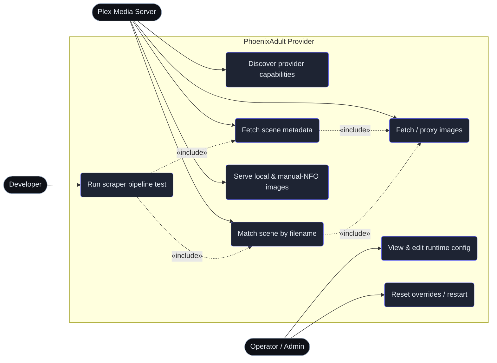

# Use Cases

## Entry Points

| Use case | Entry point | Auth |
|---|---|---|
| Discover capabilities | `GET /<provider mount>/` | Plex only (see [Provider Endpoints](#provider-endpoints)) |
| Match scene | `POST /<mount>/library/metadata/matches` | Plex only |
| Fetch metadata | `GET /<mount>/library/metadata/{rating_key}` | Plex only |
| Fetch/proxy image | `GET\|HEAD /images/proxy`, `/images/proxy-classified` | image guard (see [Image Serving](#image-serving)), SSRF-guarded |
| Local/manual images | `GET /images/local/{filename}`, `/images/manual-nfo/*` | image guard, path-guarded |
| Sign in / first-run setup | `GET\|POST /login`, `/setup` | public, rate limited; `/setup` 404s once a user exists |
| Runtime config | `GET\|POST /config/...` | **session or API key** |
| User accounts | `GET\|POST /users/api/...` | **session or API key, admin only** |
| Account self-service | `GET /account` + `POST /account/api/...` | **session or API key** |
| Network state (top-bar banner) | `GET /api/network` | **session or API key** |
| Cache, logo and queue review UIs | `GET /people`, `/metadata`, `/logos`, `/queue` | **session or API key**; read-only for non-admins (write controls hidden, their endpoints 403) |
| Stored-search browser | `GET\|POST /searches/...` | **session or API key, admin only**; page, APIs and nav link all hidden from non-admins |
| Cache editors | `GET /metadata/edit`, `/people/edit` (see [Cache Editors](#cache-editors)) | **session or API key**; `POST …/save` and every purge/restore/gender/fetch/rescan/flush endpoint is **admin only** |
| Snapshot re-scrape | `POST /metadata/refresh`, `/metadata/refresh-bulk` | **session or API key, admin only** (re-scraping rewrites snapshots); `GET /metadata/snapshot` stays readable |
| Cast autocomplete | `GET /metadata/actors?q=` | **session or API key** |
| Plex connections | `GET\|POST /plex/connections/...` | **session or API key**; each connection is scoped to its owner |
| Dev pipeline test | `GET\|POST /dev/...` (`DEV_UI_ENABLE` only) | **session or API key** |
| Image serving | `GET /images/*`, `GET /cache/*` | image guard (see [Image Serving](#image-serving)) |
| Provider endpoints | `GET\|POST /<mount>/...` | `PlexMediaServer` User-Agent, plus optional keys (see [Provider Endpoints](#provider-endpoints)) |

> **First run:** with no accounts in the database every admin page redirects to `/setup`, which creates the first (admin) account and signs it in. After that `/setup` 404s and `/login` is the only way in — there is no loopback bypass. If every admin password is lost, `python scripts/reset_password.py <username> --create-admin` restores access from a shell on the server.

## Cache Editors

`GET /metadata/edit` edits one cached scene:

- **Locks.** Fields, single images and the whole image set can be locked; locked pieces survive re-scrapes, and editing a field locks it automatically.
- **Source link.** The header links to the source scene or listing page, decoded from the `cur_id`. For slug-only sites `SiteInfo.direct_url_template` rebuilds it.
- **Data18 link.** A second header link opens the Data18 page for whatever numeric id the form holds — `scenes/` or `movies/` by the type select. It updates as you type and hides while the field is blank.
- **Source JSON.** JSON and API payloads render in a lazy Source JSON panel via `GET /metadata/source-json`.
- **Opening and closing.** The list's Edit button opens the editor in a new tab; Save and Cancel close it and refresh the list behind it in place. The tab opens *without* `noopener`, because a tab with no opener cannot close itself (both pages are same-origin).
- **Opened directly.** An editor with no opener falls back to navigating to the list at the offset in its `back` parameter. Filters and sort come back from `localStorage`, so only the page number needs the round trip.

`/people/edit` is the matching editor for one cached headshot.

## Image Serving

`/images/*` and `/cache/*` are guarded by default (`IMAGE_GUARD_ENABLE`, `phoenixadult/utils/auth/image_guard.py`). A request is served when it comes from any of:

- a signed URL — `sig=` is an HMAC keyed by the server secret, with no expiry (`phoenixadult/utils/auth/url_signing.py`);
- Plex (a `PlexMediaServer` User-Agent);
- an image fetcher (`Accept: image/*` on a non-navigation request);
- loopback;
- a signed-in session or API key;
- a same-origin admin-UI subresource.

Direct browsing gets a 403.

## Provider Endpoints

The provider mount is guarded in layers (`phoenixadult/routes/provider_guard.py`):

1. **User-Agent.** It must contain `PlexMediaServer`; browsers and everything else get a 404, so the mount is invisible to them.
2. **`TOKEN_BASED_AUTH`.** The mount answers only through `/api/hook/{api-key}/<mount>`. `phoenixadult/utils/auth/hook_middleware.py` validates the key, rate-limits failures per IP and rewrites the path before routing. There is no loopback or session bypass, and the key segment is always masked in logs.
3. **`CLIENT_TOKEN_REQUIRED`.** Match and metadata requests also need an `X-Plex-Client-Identifier` registered under a Plex connection. The capability document stays open so the provider can always be added.
4. **`API_REQUESTS_PER_DAY`.** Caps each client and each key per day (429 with `Retry-After`).

Every request, refused ones included, is dumped at `verbose` with credential headers masked (`utils/logging/request_trace.py`).
